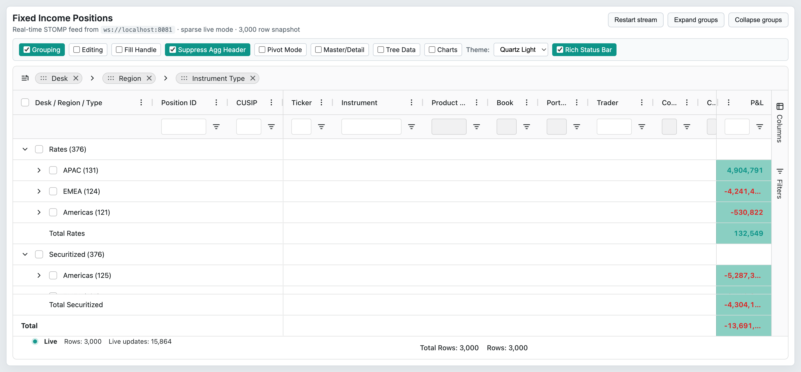

# 01 — Grid Options

## Concept

`GridOptions<TData>` is the single configuration interface consumed at grid construction time.
Properties fall into two lifecycle buckets:

- **Initial-only** (`@initial` tag in `.d.ts`): read once during grid initialisation; updating them at runtime
  via `api.setGridOption()` or `api.updateGridOptions()` has no effect.
- **Runtime-mutable**: can be updated at any time via `api.setGridOption(key, value)` or the batched
  `api.updateGridOptions(options)`.

The grid is created by mounting `<AgGridReact>` (React) or instantiating `createGrid` (vanilla JS).
Destruction is triggered by framework unmount or by calling `api.destroy()` directly.

## Configuration surface

| Option | Type | Default | Tier | Description |
|--------|------|---------|------|-------------|
| `rowData` | `TData[] \| null` | `undefined` | Community | Inline row data for Client-Side Row Model. Runtime-mutable. |
| `columnDefs` | `(ColDef \| ColGroupDef)[] \| null` | `undefined` | Community | Array of column and column-group definitions. Runtime-mutable. |
| `defaultColDef` | `ColDef<TData>` | `undefined` | Community | Shared defaults applied to every column. Runtime-mutable. |
| `defaultColGroupDef` | `Partial<ColGroupDef<TData>>` | `undefined` | Community | Shared defaults applied to every column group. Initial-only. |
| `columnTypes` | `ColTypeDefs<TData>` | `undefined` | Community | Named type templates reused across column defs. Runtime-mutable. |
| `rowModelType` | `'clientSide' \| 'infinite' \| 'serverSide' \| 'viewport'` | `'clientSide'` | Community/Enterprise | Selects the row model. Initial-only. |
| `getRowId` | `GetRowIdFunc<TData>` | `undefined` | Community | Pure function returning a unique string ID per row. Initial-only. |
| `rowBuffer` | `number` | `10` | Community | Extra rows rendered above/below the viewport. Runtime-mutable. |
| `domLayout` | `'normal' \| 'autoHeight' \| 'print'` | `'normal'` | Community | Controls grid height behaviour. Runtime-mutable. |
| `animateRows` | `boolean` | `true` | Community | Enables CSS row-position transition animations. Runtime-mutable. |
| `suppressColumnVirtualisation` | `boolean` | `false` | Community | Renders all columns regardless of horizontal scroll. Initial-only. |
| `suppressRowVirtualisation` | `boolean` | `false` | Community | Renders all rows regardless of vertical scroll. Initial-only. |
| `suppressMaxRenderedRowRestriction` | `boolean` | `false` | Community | Removes the 500-row cap when row virtualisation is off. Initial-only. |
| `suppressAnimationFrame` | `boolean` | `false` | Community | Disables async animation-frame row drawing during scroll. Initial-only. |
| `suppressChangeDetection` | `boolean` | `false` | Community | Disables change-detection optimisation. Runtime-mutable. |
| `debug` | `boolean` | `false` | Community | Enables verbose console logging. Initial-only. |
| `context` | `any` | `undefined` | Community | Arbitrary application data forwarded to all callbacks. Initial-only. — Deprecated since v33; use the same property directly on the entity needing it. |
| `loading` | `boolean` | `undefined` | Community | Explicitly show/hide loading overlay. Runtime-mutable. |
| `suppressOverlays` | `OverlayType[]` | `undefined` | Community | Named overlay types to suppress. Runtime-mutable. |
| `overlayComponent` | `any` | `undefined` | Community | Custom overlay component for all grid-provided overlays. Initial-only. |
| `components` | `Components` | `undefined` | Community | Map of component keys to component implementations. Initial-only. |
| `gridId` | `string` | auto | Community | Custom grid identifier; sets `grid-id` DOM attribute. Initial-only. |
| `initialState` | `GridState` | `undefined` | Community | Serialised grid state restored on init. Initial-only. |
| `asyncTransactionWaitMillis` | `number` | `undefined` | Community | Batching window (ms) for `applyTransactionAsync`. Runtime-mutable. |
| `suppressModelUpdateAfterUpdateTransaction` | `boolean` | `false` | Community | Prevents sort/filter/group refresh on update-only transactions. Runtime-mutable. |
| `valueCache` | `boolean` | `false` | Community | Enables `valueGetter` result caching. Initial-only. |
| `valueCacheNeverExpires` | `boolean` | `false` | Community | Stops value cache from expiring after data updates. Initial-only. |
| `enableRtl` | `boolean` | `false` | Community | Right-to-left grid layout. Initial-only. |
| `ensureDomOrder` | `boolean` | `false` | Community | DOM row/column order matches visual order; disables row animations. Initial-only. |
| `tabIndex` | `number` | `0` | Community | Grid container tab index. Initial-only. |
| `maintainColumnOrder` | `boolean` | `false` | Community | Preserves column order when column definitions are updated. Runtime-mutable. |
| `suppressFieldDotNotation` | `boolean` | `false` | Community | Treats dots in field names as literals, not path separators. Runtime-mutable. |
| `pagination` | `boolean` | `false` | Community | Enables pagination. Runtime-mutable. |
| `paginationPageSize` | `number` | `100` | Community | Rows per page. Runtime-mutable. |
| `paginationAutoPageSize` | `boolean` | `false` | Community | Auto-sizes page to grid viewport height. Runtime-mutable. |
| `pinnedTopRowData` | `any[]` | `undefined` | Community | Rows pinned to the top. Runtime-mutable. |
| `pinnedBottomRowData` | `any[]` | `undefined` | Community | Rows pinned to the bottom. Runtime-mutable. |
| `rowHeight` | `number` | `25` | Community | Default row height in pixels. Runtime-mutable. |
| `getRowHeight` | `GetRowHeight<TData>` | `undefined` | Community | Per-row height callback. Runtime-mutable. |
| `cellFlashDuration` | `number` | `500` | Community | Milliseconds cell stays in flashed state. Runtime-mutable. |
| `cellFadeDuration` | `number` | `1000` | Community | Milliseconds for flash fade-out animation. Runtime-mutable. |
| `sideBar` | `SideBarDef \| string \| string[] \| boolean \| null` | `undefined` | Enterprise | Side panel configuration. Runtime-mutable. |
| `statusBar` | `StatusBar` | `undefined` | Enterprise | Status bar panel configuration. Runtime-mutable. |
| `toolbar` | `Toolbar` | `undefined` | Enterprise | Toolbar items configuration. Runtime-mutable. |
| `pivotMode` | `boolean` | `false` | Enterprise | Enables pivot mode. Runtime-mutable. |
| `masterDetail` | `boolean` | `false` | Enterprise | Enables master/detail expansion. Runtime-mutable. |

## API methods

| Method | Signature | Tier | Description |
|--------|-----------|------|-------------|
| `getGridId` | `() => string` | Community | Returns the `gridId` for this grid instance. |
| `getGridOption` | `<Key>(key: Key) => GridOptions[Key]` | Community | Returns the current value of a grid option. |
| `setGridOption` | `<Key>(key: ManagedGridOptionKey, value: GridOptions[Key]) => void` | Community | Updates a single runtime-mutable grid option. |
| `updateGridOptions` | `(options: ManagedGridOptions) => void` | Community | Batch-updates multiple runtime-mutable grid options. |
| `destroy` | `() => void` | Community | Destroys the grid instance and releases all resources. |
| `isDestroyed` | `() => boolean` | Community | Returns `true` if `destroy()` has been called. |
| `isModuleRegistered` | `(moduleName: AgModuleName) => boolean` | Community | Checks whether a module is registered with this grid instance. |
| `addEventListener` | `(eventType, listener) => void` | Community | Subscribes to a grid event. |
| `removeEventListener` | `(eventType, listener) => void` | Community | Unsubscribes from a grid event. |
| `addGlobalListener` | `(listener) => void` | Community | Subscribes to all grid events. |
| `removeGlobalListener` | `(listener) => void` | Community | Unsubscribes the global listener. |

## Events

| Event | Payload | Tier | Fires when |
|-------|---------|------|-----------|
| `gridReady` | `GridReadyEvent` | Community | Grid has fully initialised; `api` is available. |
| `gridPreDestroyed` | `GridPreDestroyedEvent { state: GridState }` | Community | Before grid teardown; `state` snapshot available. |
| `gridSizeChanged` | `GridSizeChangedEvent { clientWidth, clientHeight }` | Community | Grid container element is resized. |
| `stateUpdated` | `StateUpdatedEvent { sources, state }` | Community | Any serialisable grid state changes (sort, filter, column, etc.). |
| `componentStateChanged` | `ComponentStateChangedEvent` | Community | Framework component state update was applied. |
| `firstDataRendered` | `FirstDataRenderedEvent { firstRow, lastRow }` | Community | First time rows are rendered in the DOM. |

## Behaviors / interactions

**Grid creation flow:** Grid initialises modules, processes `columnDefs`, sets up the row model, applies
`initialState` if provided, renders the viewport, then fires `gridReady`.

**Lifecycle — initial vs runtime options:** Properties tagged `@initial` in the `.d.ts` are read once;
`setGridOption` silently ignores them at runtime. Runtime-mutable properties apply immediately and
trigger the minimal required refresh.

**`getRowId` immutable contract:** Once set, the callback must return the same ID for the same logical
row throughout the grid's life. Changing the callback identity at runtime without a full data reload
causes undefined behaviour. See `03-row-models.md` for delta-detection rules.

**Overlay lifecycle:** Grid shows the loading overlay automatically (CSRM) until `rowData` and
`columnDefs` are provided. Explicitly set `loading: true/false` to override. Individual overlays can
be suppressed via `suppressOverlays`.

**`asyncTransactionWaitMillis` batching:** Transactions queued via `applyTransactionAsync` accumulate for
this many milliseconds, then the grid flushes all pending transactions in a single pass and fires
`asyncTransactionsFlushed`. See `04-data-updates.md` for full details.

**Debug mode:** When `debug: true`, the grid logs detailed timing and update information to the console.
The `ValidationModule` additionally reports misconfigurations at startup.

## Look & feel

 — The toggle strip added in Task 8b-A: checkboxes for Grouping, Editing, Fill Handle, Suppress Agg Header, Pivot Mode, Master/Detail, Tree Data, Charts; a Theme dropdown (Quartz Light/Dark, Alpine, Material); and the Rich Status Bar toggle. Each control live-reconfigures the grid options without a page reload.

## Canvas-port implications

- The canvas grid must have an equivalent "options object" that separates initial-only from runtime-mutable properties. Violating this constraint causes subtle bugs (e.g. silent no-ops).
- A lifecycle event equivalent to `gridReady` is needed so consumers can safely start calling the API.
- A `getRowId` concept is mandatory for efficient delta updates; the canvas engine should enforce identity stability once set.
- `rowBuffer` has a direct analogue in canvas overscan: the number of extra rows rendered beyond the visible clip region. Q: should canvas overscan be in rows or pixels?
- `domLayout` modes (`autoHeight`, `print`) have no 1:1 canvas equivalent — the canvas container height strategy must be explicitly designed. Q: does the canvas port target a fixed-height container only, or also auto-height?
- `ensureDomOrder` is irrelevant for a canvas grid (no DOM rows), but an equivalent "stable render order" flag may be needed for accessibility overlays.
- `debug` and `ValidationModule` patterns should be ported as a structured logging layer with configurable verbosity.
