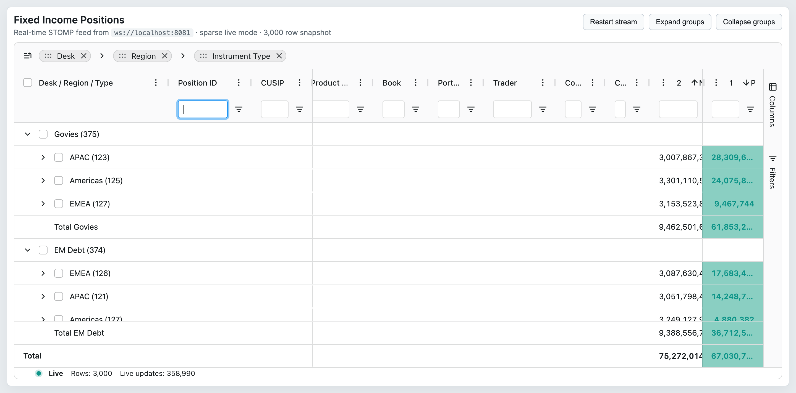
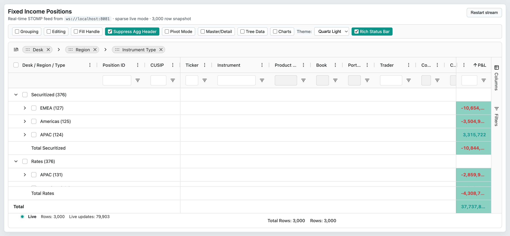

# 07 — Sorting

## Concept

Sorting in AG Grid orders the displayed rows according to one or more column values. The grid supports:

- **Single-column sort** — click a column header; cycles through `asc` → `desc` → unsorted (configurable
  via `sortingOrder`).
- **Multi-column sort** — hold Shift (or Ctrl/Command when `multiSortKey: 'ctrl'`) and click additional
  headers. Each column in the sort gets a numeric `sortIndex` badge.
- **Custom comparators** — `ColDef.comparator` replaces the default sort logic for a column.
- **Post-sort hook** — `postSortRows` allows arbitrary reordering after the primary sort is applied (e.g.,
  pinning certain rows to the top regardless of sort direction).
- **`accentedSort`** — when enabled, accented characters are sorted distinctly rather than collapsed to
  their base character.

Sort state is part of `ColumnState` (see `02-column-model.md`) and can be round-tripped via
`getColumnState()` / `applyColumnState()`. Sort state is also part of the serialisable `GridState`.

Cross-reference: `deltaSort` (grid option that limits re-sort to transaction-changed rows) is documented
in `04-data-updates.md`. Row grouping sort (group column comparator) is in `09-row-grouping.md`.

## Configuration surface

### GridOptions — sorting

| Option | Type | Default | Tier | Description |
|--------|------|---------|------|-------------|
| `accentedSort` | `boolean` | `false` | Community | Use locale-aware comparison that distinguishes accented characters. Slower than the default comparator. |
| `suppressMultiSort` | `boolean` | `false` | Community | Disable multi-column sort; only one column can be sorted at a time. |
| `alwaysMultiSort` | `boolean` | `false` | Community | Every column header click is treated as a multi-sort click (no Shift required). |
| `multiSortKey` | `'ctrl'` | `undefined` | Community | Change the multi-sort modifier key from Shift to Ctrl / Command on Mac. |
| `suppressMaintainUnsortedOrder` | `boolean` | `false` | Community | Do not preserve the original row order when sort is cleared; rows stay in their last sorted order. |
| `deltaSort` | `boolean` | `false` | Community | When applying a transaction, only re-sort the affected rows instead of the full dataset. Ignored if `postSortRows` is configured. See `04-data-updates.md`. |
| `postSortRows` | `PostSortRows<TData>` | `undefined` | Community | Callback `(params: { nodes: IRowNode[] }) => void` invoked after the primary sort to apply custom ordering. Disables `deltaSort`. |
| `sortingOrder` | `SortDirection[]` | `undefined` | Community | **Deprecated v33.** Use `defaultColDef.sortingOrder` instead. Grid-level sort cycle array. |
| `unSortIcon` | `boolean` | `false` | Community | **Deprecated v33.** Use `defaultColDef.unSortIcon` instead. Show unsorted icon on all columns. |

### ColDef — per-column sorting

| Option | Type | Default | Tier | Description |
|--------|------|---------|------|-------------|
| `sortable` | `boolean` | `true` | Community | Set to `false` to disable sorting for this column. |
| `sort` | `SortDirection \| SortDef` | `undefined` | Community | Initial sort direction for this column (`'asc'`, `'desc'`, or `null`). Can also be a `SortDef` object that includes a `type` for absolute sorting. |
| `initialSort` | `SortDirection \| SortDef` | `undefined` | Community | Same as `sort` but applied only on first column creation; ignored on subsequent definition updates. `@initial`. |
| `sortIndex` | `number \| null` | `undefined` | Community | Position of this column in a multi-sort (0 = primary). |
| `initialSortIndex` | `number` | `undefined` | Community | Same as `sortIndex`, applied on first creation only. `@initial`. |
| `sortingOrder` | `(SortDirection \| SortDef)[]` | varies | Community | Cycle order for this column. Defaults to `['asc', 'desc', null]`. For absolute-type sorts defaults include `SortDef` objects. |
| `comparator` | `SortComparatorFn \| Partial<Record<SortType, SortComparatorFn>>` | `undefined` | Community | Custom sort comparator. Signature: `(valueA, valueB, nodeA, nodeB, isDescending) => number`. A negative result sorts A before B; positive sorts B before A; zero treats them as equal. Can be a map of comparators keyed by `SortType`. |
| `unSortIcon` | `boolean` | `false` | Community | Show the unsorted icon when this column has no active sort. |

## API methods

| Method | Signature | Tier | Description |
|--------|-----------|------|-------------|
| `onSortChanged` | `() => void` | Community | Notify the grid that sort state has changed externally (e.g., after mutating a column's `sort` property). Triggers a full re-sort of the displayed rows. |
| `applyColumnState` | `(params: ApplyColumnStateParams) => boolean` | Community | Set `sort` and `sortIndex` on one or more columns programmatically. See `02-column-model.md` for full signature. |
| `getColumnState` | `() => ColumnState[]` | Community | Returns serialisable column state including `sort` and `sortIndex`. See `02-column-model.md`. |

## Events

| Event | Payload | Tier | Fires when |
|-------|---------|------|-----------|
| `sortChanged` | `SortChangedEvent { source: string, columns?: Column[] }` | Community | The active sort changes (user click, API call, or `applyColumnState`). `columns` lists the affected columns. |

## Behaviors / interactions

**Sort cycle:** Clicking a sortable column header advances through `sortingOrder`. The default cycle is
`[null, 'asc', 'desc']` (first click → ascending, second → descending, third → clears sort). This can be
changed per-column with `sortingOrder` on `ColDef`.

**Multi-sort mechanics:** When multi-sort is active, each sorted column receives a `sortIndex` (0-based)
badge in its header indicating its position in the composite sort key. Columns are sorted left-to-right
by ascending `sortIndex`. Shift-clicking a sorted column clears only that column from the composite sort;
Shift-clicking an unsorted column adds it at the next available `sortIndex`.

**`multiSortKey: 'ctrl'`:** When set, the modifier key for multi-sort changes from Shift to Ctrl on
Windows or Command on macOS. Setting `alwaysMultiSort: true` makes every click multi-sort without any
modifier key.

**Custom comparator contract:** The comparator function receives the raw cell values (`valueA`, `valueB`),
the corresponding `IRowNode`s, and `isDescending`. It must return a number: negative means A before B,
positive means B before A, zero means equal. The grid applies `asc`/`desc` direction to the sign of the
return value internally — **do not negate the return value based on `isDescending`**.

**`comparator` as a map of `SortType` comparators:** When `sort` or `initialSort` uses a `SortDef` with a
`type` (e.g., absolute sort), `comparator` can be a partial map `{ [type: string]: SortComparatorFn }`
to provide type-specific logic. If no matching key is found, the grid falls back to the default comparator
for that `SortType`.

**Post-sort hook (`postSortRows`):** Called after all primary sort columns are applied, with the fully
sorted `nodes` array. Mutating the array in-place (e.g., moving pinned rows to index 0) is permitted. When
`postSortRows` is configured, `deltaSort` is ignored and a full sort is always performed.

**`accentedSort`:** Uses `String.localeCompare` with sensitivity `'accent'` instead of simple `<` / `>`
comparison. This correctly distinguishes é from e but is measurably slower on large datasets.

**`suppressMaintainUnsortedOrder`:** By default, when the user clears a sort, rows return to their original
insertion order (the order data was provided). Setting this to `true` keeps rows in the order from the
last applied sort, which can be preferable when new rows are continuously added.

**`deltaSort` interaction with transactions:** See `04-data-updates.md`. When a transaction adds or updates
rows, `deltaSort: true` restricts re-sort to only those affected nodes instead of re-sorting the full
dataset. This significantly reduces CPU work for high-frequency streaming grids. Disabled automatically
when `postSortRows` is present.

**`getRowId` and stable sort:** When `getRowId` is configured (see `01-grid-options.md`), row identity
is stable across data updates. Sort order is preserved for unchanged rows during delta transactions,
which prevents unnecessary row-position thrash in the DOM.

## Look & feel

 — Three sort indicators visible on P&L (desc, 1), Notional (asc, 2), and Market Value (desc, 3) columns simultaneously.
-  — Descending sort on P&L with grouping off; single-direction indicator visible in the header.

## Canvas-port implications

- The sort pipeline (`valueGetter` → comparator → `postSortRows`) must be replicated identically in the
  canvas engine. The canvas layer must not use a different sort path from the DOM version.
- Sort icons (ascending, descending, unsorted, `unSortIcon`) and `sortIndex` badges are header-layer
  decorations; the canvas port needs header-cell rendering support for these indicators.
- `multiSortKey: 'ctrl'` and `alwaysMultiSort` are input-handling concerns; the canvas event layer must
  intercept the same modifier keys as the DOM layer.
- `accentedSort` relies on `String.localeCompare`; this is platform-level and should behave identically
  in a canvas renderer since sorting occurs in JS before the canvas draw pass.
- `postSortRows` is a post-processing callback on the sorted `IRowNode[]` array; it is agnostic to the
  renderer and can be used as-is in the canvas port.
- Column state round-trip (`getColumnState` / `applyColumnState`) persists sort state; the canvas port
  must implement the same `ColumnState` schema so saved states are portable between DOM and canvas grids.
- Q: Does the canvas port maintain a separate JS sort pipeline, or does it reuse the CSRM's sort service?
  Sharing the CSRM pipeline is strongly preferred to avoid divergence.
