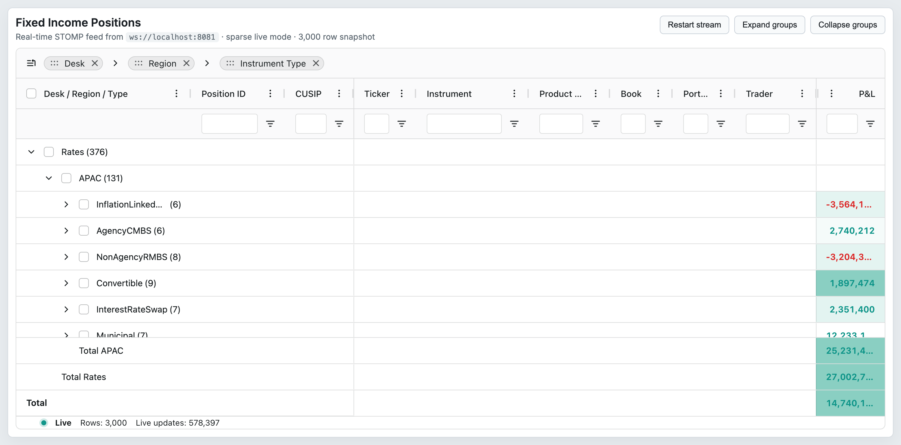
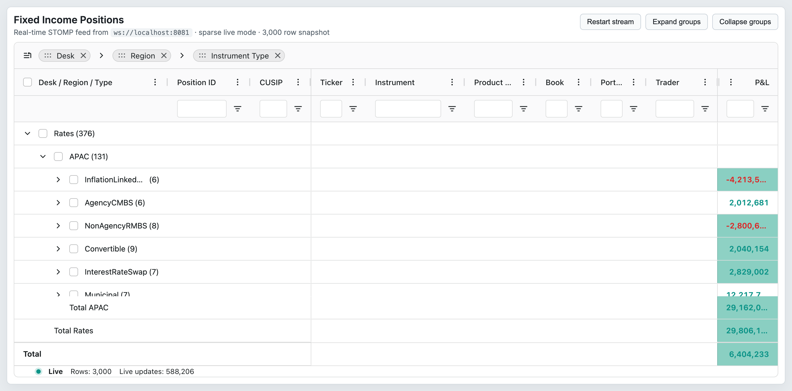

# 09 — Row Grouping

## Concept

Row grouping collapses rows that share the same value in one or more designated columns into a
collapsible group node. It is an **Enterprise** feature gated by `RowGroupingModule`. The grouping
pipeline runs inside the Client Side Row Model (CSRM) and the Server Side Row Model (SSRM); the
Infinite and Viewport models do not support it.

Key concepts:

- **Group columns** — `ColDef.rowGroup` / `rowGroupIndex` declare which columns group rows. Multiple
  columns can be stacked into a hierarchy (first `rowGroupIndex=0`, then `1`, etc.).
- **Auto group column** — the grid automatically inserts a special group column (or columns) based
  on `groupDisplayType`. The appearance is controlled by `autoGroupColumnDef`.
- **Group display types** — four modes control how group columns appear: `singleColumn`,
  `multipleColumns`, `groupRows`, and `custom`. See `## Behaviors / interactions` for descriptions.
- **Aggregation** — group nodes display aggregated values from child rows; covered in
  `10-aggregation.md`.
- **Group totals / grand totals** — optional extra rows showing aggregate values at group and grid
  levels via `groupTotalRow` / `grandTotalRow`.
- **`groupSelectsChildren`** — deprecated v32.2; cross-reference to `12-selection.md`.

## Configuration surface

### ColDef — row-group properties

| Option | Type | Default | Tier | Description |
|--------|------|---------|------|-------------|
| `rowGroup` | `boolean \| null` | `undefined` | Enterprise | Set `true` to group rows by this column. Requires `RowGroupingModule`. |
| `initialRowGroup` | `boolean` | `undefined` | Enterprise | Same as `rowGroup` but applied only on first column creation; ignored on updates. |
| `rowGroupIndex` | `number \| null` | `undefined` | Enterprise | Order of this column in the group hierarchy (0 = first). |
| `initialRowGroupIndex` | `number` | `undefined` | Enterprise | Same as `rowGroupIndex` but initial-only. |
| `enableRowGroup` | `boolean` | `false` | Enterprise | Allows user to drag this column into the row-group panel via the GUI; does not block API grouping. |
| `showRowGroup` | `string \| boolean` | `undefined` | Enterprise | When `true`, the group column cell displays the grouped-column value. When a `colId` string, only that column's value is shown. Initial-only. |
| `groupHierarchy` | `(GroupHierarchyParts \| string \| ColDef)[]` | `undefined` | Enterprise | Declares virtual sub-columns derived from this column for date-part or custom hierarchy grouping. Configured globally via `groupHierarchyConfig`. |
| `rowGroupingHierarchy` | `(GroupHierarchyParts \| string \| ColDef)[]` | `undefined` | Enterprise | **Deprecated.** Use `groupHierarchy` instead. |

### GridOptions — row-grouping properties

| Option | Type | Default | Tier | Description |
|--------|------|---------|------|-------------|
| `groupDisplayType` | `RowGroupingDisplayType` | `'singleColumn'` | Enterprise | Controls how group columns are rendered. Values: `'singleColumn'`, `'multipleColumns'`, `'groupRows'`, `'custom'`. |
| `groupDefaultExpanded` | `number` | `0` | Enterprise | Number of group levels to expand on load. `-1` expands all. |
| `autoGroupColumnDef` | `AutoGroupColumnDef<TData>` | `undefined` | Enterprise | Overrides for the auto-generated group column(s). Equivalent to `ColDef` minus `colId`. |
| `groupMaintainOrder` | `boolean` | `false` | Enterprise | When `true`, non-group column sorts do not reorder groups; only within-group rows are sorted. |
| `groupLockGroupColumns` | `number` | `0` | Enterprise | Number of leading group columns to lock. `0` = none, `-1` = all. Initial-only. |
| `groupAggFiltering` | `boolean \| IsRowFilterable<TData>` | `false` | Enterprise | Applies filters to group-level aggregated values instead of leaf rows. |
| `groupTotalRow` | `'top' \| 'bottom' \| UseGroupTotalRow<TData>` | `undefined` | Enterprise | Adds a group total row at the given position when the group is expanded. Callback form allows per-group control. |
| `grandTotalRow` | `'top' \| 'bottom' \| 'pinnedTop' \| 'pinnedBottom'` | `undefined` | Enterprise | Inserts a grand total row at the grid level. `'pinnedTop'`/`'pinnedBottom'` pins the row so it stays visible during scroll. |
| `suppressStickyTotalRow` | `boolean \| 'grand' \| 'group'` | `undefined` | Enterprise | Disables sticky behaviour for total rows. Pass `'grand'` or `'group'` to suppress selectively. |
| `groupSuppressBlankHeader` | `boolean` | `false` | Enterprise | Hides the empty header cell in a group column when aggregate data would otherwise jump between header and footer. |
| `showOpenedGroup` | `boolean` | `false` | Enterprise | Shows the opened group value in the group column for non-group child rows. |
| `groupHideOpenParents` | `boolean` | `false` | Enterprise | Hides parent group rows when they are expanded; child groups appear at the top level. Useful with `multipleColumns`. |
| `groupHideColumnsUntilExpanded` | `boolean` | `false` | Enterprise | With `multipleColumns` or `groupHideOpenParents`, hides deeper-level group columns until the preceding level is expanded. CSRM only. |
| `groupHideParentOfSingleChild` | `boolean \| 'leafGroupsOnly'` | `false` | Enterprise | Replaces a group node with its single child row. `'leafGroupsOnly'` applies only to the lowest level. |
| `groupRemoveSingleChildren` | `boolean` | `false` | Enterprise | **Deprecated v33.** Use `groupHideParentOfSingleChild` instead. |
| `groupRemoveLowestSingleChildren` | `boolean` | `false` | Enterprise | **Deprecated v33.** Use `groupHideParentOfSingleChild: 'leafGroupsOnly'` instead. |
| `groupSelectsChildren` | `boolean` | `false` | Enterprise | **Deprecated v32.2.** Use `rowSelection.groupSelects` instead. When true, selecting a group selects its descendant leaves. |
| `groupSelectsFiltered` | `boolean` | `false` | Enterprise | **Deprecated v32.2.** Use `rowSelection.groupSelects` configuration instead. When true with `groupSelectsChildren`, only filtered descendants are selected. |
| `groupAllowUnbalanced` | `boolean` | `false` | Enterprise | Prevents creation of a `(Blanks)` group for rows with no value in a group column. |
| `rowGroupPanelShow` | `'always' \| 'onlyWhenGrouping' \| 'never'` | `'never'` | Enterprise | Controls visibility of the drag-and-drop row group panel above the grid. Requires `RowGroupingPanelModule`. |
| `rowGroupPanelSuppressSort` | `boolean` | `false` | Enterprise | Hides sort indicators and actions in the row group panel. Requires `RowGroupingPanelModule`. |
| `groupRowRenderer` | `any` | `undefined` | Enterprise | Custom cell renderer for group rows when `groupDisplayType='groupRows'`. |
| `groupRowRendererParams` | `any` | `undefined` | Enterprise | Params for `groupRowRenderer`. |
| `suppressGroupRowsSticky` | `boolean` | `false` | Enterprise | Prevents group rows from sticking to the grid top while scrolling. Initial-only. |
| `groupHierarchyConfig` | `GroupHierarchyConfig` | `undefined` | Enterprise | Registers custom hierarchy types for use in `colDef.groupHierarchy`. |
| `initialGroupOrderComparator` | `InitialGroupOrderComparator<TData>` | `undefined` | Enterprise | Callback to set initial ordering of group nodes. |

## API methods

| Method | Signature | Tier | Description |
|--------|-----------|------|-------------|
| `setRowGroupColumns` | `(colKeys: ColKey[]) => void` | Enterprise | Replaces the current row-group columns with the given set. |
| `addRowGroupColumns` | `(colKeys: ColKey[]) => void` | Enterprise | Adds columns to the row-group hierarchy. |
| `removeRowGroupColumns` | `(colKeys: ColKey[]) => void` | Enterprise | Removes columns from the row-group hierarchy. |
| `moveRowGroupColumn` | `(fromIndex: number, toIndex: number) => void` | Enterprise | Reorders row-group columns by index. |
| `getRowGroupColumns` | `() => Column[]` | Enterprise | Returns current row-group columns in hierarchy order. |
| `expandAll` | `() => void` | Community | Expands all group nodes — primarily used with row grouping (Enterprise). |
| `collapseAll` | `() => void` | Community | Collapses all group nodes — primarily used with row grouping (Enterprise). |
| `setRowNodeExpanded` | `(rowNode: IRowNode<TData>, expanded: boolean, expandParents?: boolean, forceSync?: boolean) => void` | Community | Sets expanded state on a single group node. `expandParents=true` also expands ancestors — primarily used with row grouping (Enterprise). |
| `onGroupExpandedOrCollapsed` | `() => void` | Community | Notifies the grid that row node expansion state has been mutated externally; triggers a refresh without running the full pipeline — primarily used with row grouping (Enterprise). |

## Events

| Event | Payload | Tier | Fires when |
|-------|---------|------|-----------|
| `rowGroupOpened` | `RowGroupOpenedEvent { expanded: boolean; node: IRowNode; data: TData; rowIndex: number \| null }` | Enterprise | A group row is expanded or collapsed. `expanded` is `true` when opening. |
| `columnRowGroupChanged` | `ColumnRowGroupChangedEvent { column: Column \| null; columns: Column[] \| null; source: ColumnEventType }` | Enterprise | A column is added to or removed from the row-group hierarchy. |

## Behaviors / interactions

**`groupDisplayType` modes:**

- `'singleColumn'` (default) — all group levels share one auto group column. The cell renderer
  indents by depth and shows the group value with an expand/collapse control.
- `'multipleColumns'` — one auto group column is generated per group level. Each column shows only
  its level's group value; deeper columns appear as child rows scroll into view.
- `'groupRows'` — no group column is generated; instead a full-width group row replaces the header.
  Use `groupRowRenderer` / `groupRowRendererParams` to customise its appearance.
- `'custom'` — no auto group columns; the developer supplies their own columns with
  `showRowGroup: true` or `showRowGroup: '<colId>'` to control what is displayed.

**Group expansion depth:** `groupDefaultExpanded` accepts `0` (all collapsed), `1` (first level
open), `2`, etc., or `-1` (all open). The grid respects this on initial data load and after
`applyTransaction` that creates new groups.

**Group sticky headers:** When `suppressGroupRowsSticky` is `false` (default), group-row headers
stick to the grid top as the user scrolls through child rows. `suppressStickyTotalRow` controls the
same behaviour for total rows.

**`groupHideOpenParents` vs `groupHideColumnsUntilExpanded`:** `groupHideOpenParents` removes the
parent row from view once expanded, making child groups appear at the outermost indentation level.
`groupHideColumnsUntilExpanded` is a complementary option that hides deeper group columns until
the user expands a group at the preceding level.

**Group order:** `initialGroupOrderComparator` sorts group nodes at creation time. Once sorted,
`groupMaintainOrder=true` locks group ordering so that a user sort on a value column does not
re-sequence groups.

**`groupSelectsChildren`** — deprecated in v32.2. Use `rowSelection.groupSelects` on the
selection configuration instead. See `12-selection.md` for the current API.

**`groupSelectsFiltered`** — deprecated in v32.2. Use `rowSelection.groupSelects` instead. See
`12-selection.md`.

**Group total rows:** `groupTotalRow` adds an extra aggregate row inside the group (position
`'top'` or `'bottom'`). A callback (`UseGroupTotalRow`) allows selective insertion (e.g. only for
groups with more than one child). `grandTotalRow` adds a grid-level total. Both rows display
`aggFunc` results from `10-aggregation.md`.

**`groupHideParentOfSingleChild`:** When a group has exactly one child, the parent group node is
replaced in-line by the child row. `'leafGroupsOnly'` applies this behaviour only at the leaf
group level, leaving higher levels unchanged.

**Unbalanced groups:** By default, rows with `null`/`undefined` in the group column are collected
under a `(Blanks)` group. Set `groupAllowUnbalanced=true` to display them alongside regular groups
without a synthetic parent.

**`autoGroupColumnDef`:** Accepts any `ColDef` property except `colId` (which is set by the grid).
Commonly used to set `minWidth`, `cellRendererParams.suppressCount`, or a custom `cellRenderer` for
the group cell.

## Look & feel

 — Desk → Region → Instrument Type hierarchy with the Rates desk expanded, showing APAC region child group visible.

 — "Total Rates" group footer row visible at the bottom of the Rates desk group, showing aggregated P&L sum for the group.

## Canvas-port implications

- The canvas port must implement the group hierarchy tree: group nodes own ordered child arrays of
  either more group nodes or leaf rows. The expansion state (`expanded` boolean on each node) drives
  which rows are included in the render list.
- `groupDisplayType` maps to a rendering strategy. `singleColumn` is the simplest; `multipleColumns`
  requires dynamically adding/removing group columns to the column set; `groupRows` replaces row
  painting with a full-width group-row painter.
- Sticky group headers require the canvas to pin a group-row strip above the scroll area while its
  children are in the viewport — a specialised layout pass distinct from pinned row pinning
  (`16-pinning-and-layout.md`).
- `groupTotalRow` / `grandTotalRow` are virtual rows that must be distinguished from leaf rows and
  group headers. The canvas row model needs a node type discriminant (leaf | group | groupTotal |
  grandTotal) to paint them with the correct style.
- Group state serialisation (which groups are expanded) should be exportable and restorable,
  parallel to `getColumnState` / `applyColumnState` in `02-column-model.md`.
- Q: Will the canvas port support `groupDisplayType='groupRows'`? If yes, a full-width row paint
  mode (see `05-rendering-and-dom.md`) must be implemented in tandem.
