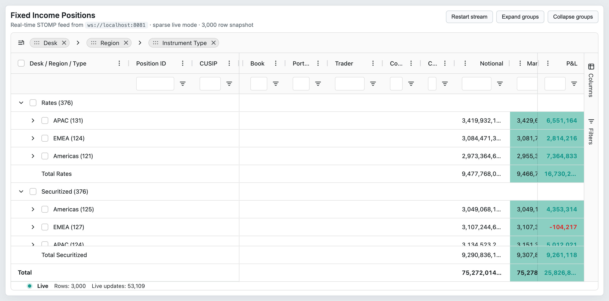
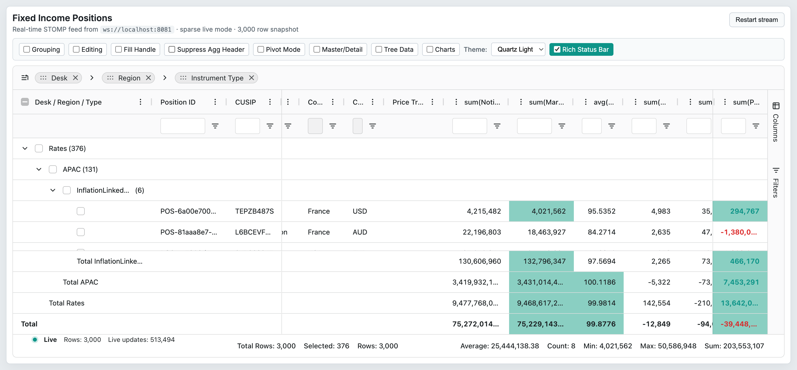

# 10 — Aggregation

## Concept

Aggregation computes summary values for group nodes in the row hierarchy. When rows are grouped
(see `09-row-grouping.md`) or pivoted (see `11-pivoting.md`), each group node displays an
aggregated value for every column that has an `aggFunc` set. Aggregation is part of the Enterprise
feature set, gated by `RowGroupingModule` (for row grouping and tree data), `PivotModule` (for
pivoting), and `ServerSideRowModelModule` (for SSRM). The `AggregationModule` must be registered
alongside whichever row-model module activates grouping.

Key concepts:

- **Built-in functions** — `sum`, `min`, `max`, `count`, `avg`, `first`, `last` are provided by
  the grid. `avg` and `count` return an `IAggFuncResult` object with `.value` and `.count`
  properties; the others return plain scalars.
- **Custom aggregators** — any function matching `IAggFunc` can be registered via `aggFuncs`
  (grid-level) or passed inline to `ColDef.aggFunc`.
- **Re-aggregation** — when a leaf row value changes the grid re-aggregates up the group tree.
  `aggregateOnlyChangedColumns=true` limits this to only the affected column.
- **Footer rows** — `groupTotalRow` and `grandTotalRow` (on `09-row-grouping.md`) display
  aggregation results. The column header label shows `'sum(Balance)'` by default; set
  `suppressAggFuncInHeader=true` to hide the function name prefix.
- **`IAggFuncResult`** — the recommended return type for custom functions that need to participate
  in nested re-aggregation (e.g. weighted averages that must carry a count upward).

## Configuration surface

### ColDef — aggregation properties

| Option | Type | Default | Tier | Description |
|--------|------|---------|------|-------------|
| `aggFunc` | `string \| IAggFunc<TData, TValue> \| null` | `undefined` | Enterprise | Aggregation function for this column. Built-in names: `'sum'`, `'min'`, `'max'`, `'count'`, `'avg'`, `'first'`, `'last'`. Also accepts an inline `IAggFunc` callback. |
| `initialAggFunc` | `string \| IAggFunc<TData, TValue>` | `undefined` | Enterprise | Same as `aggFunc` but applied only on first column creation; ignored on updates. |
| `defaultAggFunc` | `string` | `'sum'` | Enterprise | The aggregation function applied when the user enables aggregation via the GUI (column tool panel or context menu). Does not immediately aggregate; only sets the GUI default. |
| `allowedAggFuncs` | `string[]` | `undefined` | Enterprise | List of aggregation function names available for selection in the GUI. Does not restrict API or `aggFunc` property. |
| `enableValue` | `boolean` | `false` | Enterprise | Allows user to enable aggregation on this column via the GUI. Does not block API usage. |

### GridOptions — aggregation properties

| Option | Type | Default | Tier | Description |
|--------|------|---------|------|-------------|
| `aggFuncs` | `IAggFuncs<TData>` | `undefined` | Enterprise | Map of custom aggregation function names to `IAggFunc` implementations, registered at grid initialisation. Initial-only. |
| `suppressAggFuncInHeader` | `boolean` | `false` | Enterprise | When `true`, column headers show only the column name (e.g. `'Balance'` instead of `'sum(Balance)'`). |
| `alwaysAggregateAtRootLevel` | `boolean` | `false` | Enterprise | Forces root-level aggregation even when no grouping is active. |
| `aggregateOnlyChangedColumns` | `boolean` | `false` | Enterprise | Limits re-aggregation to only the columns whose leaf values changed during a transaction update. Reduces CPU cost on wide grids. |
| `suppressAggFilteredOnly` | `boolean` | `false` | Enterprise | When `true`, aggregations include all rows regardless of active filters. When `false` (default), filtered-out rows are excluded from group aggregates. |
| `functionsReadOnly` | `boolean` | `false` | Enterprise | Prevents users from changing aggregation functions via the GUI; API calls still work. |

## API methods

| Method | Signature | Tier | Description |
|--------|-----------|------|-------------|
| `addAggFuncs` | `(aggFuncs: { [key: string]: IAggFunc }) => void` | Enterprise | Registers additional custom aggregation functions at runtime, supplementing those provided in `gridOptions.aggFuncs`. |
| `clearAggFuncs` | `() => void` | Enterprise | Removes all custom aggregation functions registered via `addAggFuncs`. Built-in functions are not affected. |
| `setColumnAggFunc` | `(key: ColKey, aggFunc: string \| IAggFunc \| null \| undefined) => void` | Enterprise | Sets or clears the aggregation function on a specific column at runtime. Triggers a re-aggregation pass. |

## Events

| Event | Payload | Tier | Fires when |
|-------|---------|------|-----------|
| `columnValueChanged` | `ColumnValueChangedEvent { column: Column \| null; columns: Column[] \| null; source: ColumnEventType }` | Enterprise | A column is added to or removed from the values (aggregation) list, e.g. via the column tool panel or `setValueColumns`. |

## Behaviors / interactions

**IAggFunc signature:**

```typescript
type IAggFunc<TData = any, TValue = any, TContext = any> =
  (params: IAggFuncParams<TData, TValue, TContext>) => any;

interface IAggFuncParams<TData, TValue, TContext> extends AgGridCommon<TData, TContext> {
  values: (TValue | null)[];          // leaf values to aggregate
  column: Column<TValue>;             // column being aggregated
  colDef: ColDef<TData, TValue>;
  pivotResultColumn?: Column;         // populated when aggregating a pivot result column
  rowNode: IRowNode<TData>;           // parent group node that will receive the result
  data: TData;                        // data of the parent node (if any)
  aggregatedChildren: IRowNode<TData>[]; // immediate child nodes contributing to this aggregate
}
```

**IAggFuncResult** — recommended shape for custom functions that participate in nested re-aggregation:

```typescript
interface IAggFuncResult<TAggValue = number | bigint | null> {
  value?: TAggValue;        // the scalar result
  count?: number;           // present on avg results; used when re-aggregating across groups
  toString(): string;       // string representation; used for sorting
  toNumber?(): TAggValue;   // numeric representation; used for sorting
}
```

The built-in `avg` function returns `{ value, count, toString, toNumber }`. When re-aggregating an
average across group levels the grid uses `count` to correctly weight the nested averages. Custom
weighted-average functions should follow the same pattern.

**Built-in function behaviour:**

- `sum` — adds all numeric leaf values; ignores `null`/`undefined`.
- `min` / `max` — return the minimum/maximum numeric value in the set.
- `count` — returns an `IAggFuncResult` with `value` equal to the count of non-null leaf nodes.
- `avg` — returns an `IAggFuncResult` with `value = sum / count`. The `count` field enables correct
  weighted re-aggregation across multiple group levels.
- `first` / `last` — return the first or last value in `values` array order (insertion order).

**valueGetter interaction:** The `values` array passed to `IAggFuncParams` is populated from leaf
row values. When a `valueGetter` is defined on the column, the grid calls it for each leaf row and
passes the results as `values`. When only `field` is defined, `data[field]` is used. This means
`aggFunc` aggregates the same value that is used for display, sorting, and filtering.

**Filtering and aggregation:** By default (`suppressAggFilteredOnly=false`) the grid excludes
filtered-out rows from group aggregates, so a group's `sum` reflects only the rows that pass the
current filter. Set `suppressAggFilteredOnly=true` to aggregate all rows regardless of filtering.
`groupAggFiltering=true` (on `09-row-grouping.md`) instead applies filters to the group-level
aggregate values.

**Header label:** By default, a column with `aggFunc='sum'` displays the header as `sum(Bank Balance)`.
`suppressAggFuncInHeader=true` removes the function name prefix for a cleaner UI.

**Pivot-column aggregation:** When pivoting (`11-pivoting.md`), each pivot result column also
carries an `aggFunc`. The `IAggFuncParams.pivotResultColumn` field identifies which pivot result
column is being aggregated, allowing custom functions to branch logic per pivot key.

**GUI aggregation controls:** When `enableValue=true`, users can drag the column to the Values zone
in the column tool panel or set the function via the column context menu. `allowedAggFuncs` restricts
which functions appear in the GUI. `functionsReadOnly=true` makes the GUI display-only.

## Look & feel

 — Grid scrolled right to show Notional column with aggregated sum values in group rows and the grand total pinned-bottom row (note: `suppressAggFuncInHeader` is set, so column headers show the field name only).

 — Same view with `suppressAggFuncInHeader` toggled OFF; column headers now display "sum(Notional)", "avg(Price)", "sum(Daily P&L)" etc., making the aggregation function explicit in each header.

## Canvas-port implications

- The canvas engine must run the aggregation pipeline bottom-up through the group tree after each
  data change. The pipeline receives `values[]` per column and writes a result back onto the group
  node's data map.
- `IAggFuncResult` objects (returned by `avg` and `count`) must be handled as special values: the
  canvas renderer should call `.toString()` to get the display string, and the sort comparator
  should call `.toNumber()`.
- Weighted re-aggregation across nested group levels requires that child group results (not raw leaf
  values) are passed to parent-level `IAggFuncParams.values`. The canvas port must pass the group
  node's already-aggregated value (an `IAggFuncResult`) upward, not the original leaf values.
- `suppressAggFuncInHeader` is a rendering concern: the column header painter must strip the
  function-name prefix from the displayed label when this flag is set.
- `aggregateOnlyChangedColumns` is a performance optimisation for the canvas update loop. When a
  transaction is applied, only mark columns whose leaf data changed as dirty for re-aggregation.
- Custom `aggFuncs` registered at runtime (via `addAggFuncs`) must be stored in a mutable registry
  that the canvas pipeline consults. The registry must survive column state snapshots/restores.
