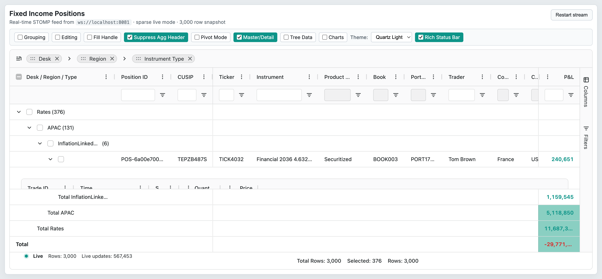

# 13 — Master / Detail

## Concept

Master/Detail is an Enterprise feature (`MasterDetailModule`) that allows a row in the master grid to expand to reveal a full embedded detail grid. Each master row acts as a container; when expanded, the grid renders a detail row below it containing a self-contained `AgGridReact` (or framework equivalent) instance with its own column definitions, row data, and options.

Key characteristics:
- The detail grid is a fully functional AG Grid instance — it can itself have grouping, sorting, filtering, and even be a master grid (nested master/detail).
- `masterDetail: true` turns on the feature. Every row is treated as a master row by default; use `isRowMaster` to make specific rows non-expandable.
- The default cell renderer (`agDetailCellRenderer`) renders the embedded grid. Supply `detailCellRenderer` to replace it entirely.
- Detail row height is fixed (`detailRowHeight`) or dynamic (`detailRowAutoHeight`). Both are initial-only.
- The `rowGroupOpened` event fires when a master row is expanded or collapsed.
- Master/Detail is documented alongside SSRM in `03-row-models.md` (conceptual overview) and cross-references `15-server-side-row-model.md` for SSRM-hosted master rows.

## Configuration surface

| Option | Type | Default | Tier | Description |
|--------|------|---------|------|-------------|
| `masterDetail` | `boolean` | `false` | Enterprise | Enables Master/Detail mode. `@agModule MasterDetailModule`. |
| `isRowMaster` | `IsRowMaster<TData>` | `undefined` | Enterprise | Callback returning `false` prevents a row from being a master (no expand icon, no detail row). `@agModule MasterDetailModule`. |
| `detailCellRenderer` | `any` | `undefined` | Enterprise | Custom cell renderer to use for detail rows instead of `agDetailCellRenderer`. |
| `detailCellRendererParams` | `IDetailCellRendererParams \| ((params) => IDetailCellRendererParams)` | `undefined` | Enterprise | Params passed to the detail cell renderer. Can be a function for per-row configuration. |
| `detailRowHeight` | `number` | `undefined` | Enterprise | Fixed pixel height for every detail row. Initial-only. |
| `detailRowAutoHeight` | `boolean` | `false` | Enterprise | When `true`, the detail row expands to fit its content. Initial-only. |
| `keepDetailRows` | `boolean` | `false` | Enterprise | Retains detail grid instances when a master row collapses, preserving detail state. Initial-only. |
| `keepDetailRowsCount` | `number` | `10` | Enterprise | Maximum number of detail grid instances to keep in memory when `keepDetailRows` is `true`. Initial-only. |

### `IDetailCellRendererParams` fields

| Field | Type | Description |
|-------|------|-------------|
| `detailGridOptions` | `GridOptions<TDetail>` | Full grid options for the embedded detail grid, including its `columnDefs`, `rowData`, and any feature flags. |
| `getDetailRowData` | `GetDetailRowData<TData, TDetail>` | Callback invoked to load the detail rows. Call `successCallback(rowData)` to supply data asynchronously. |
| `refreshStrategy` | `'rows' \| 'everything' \| 'nothing'` | How the detail grid refreshes when master row data changes: `'rows'` applies delta row updates, `'everything'` re-renders all, `'nothing'` leaves detail unchanged. |
| `template` | `string \| TemplateFunc<TData>` | Custom HTML template wrapping the detail grid; useful for adding a title or toolbar above the embedded grid. |

Note: `agGridReact` and `frameworkComponentWrapper` fields in `IDetailCellRendererParams` are deprecated as of v32.2 and no longer used.

## API methods

| Method | Signature | Tier | Description |
|--------|-----------|------|-------------|
| `getDetailGridInfo` | `(id: string) => DetailGridInfo \| undefined` | Enterprise | Returns the `DetailGridInfo` (including the detail grid's `api`) for the given `detailGridId`. The ID format is `detail_{ROW-ID}`. |
| `forEachDetailGridInfo` | `(callback: (gridInfo: DetailGridInfo, index: number) => void) => void` | Enterprise | Iterates over all currently registered detail grid instances and invokes the callback for each. |
| `addDetailGridInfo` | `(id: string, gridInfo: DetailGridInfo) => void` | Enterprise | Registers a detail grid with the master when the detail is created. Called internally by `agDetailCellRenderer`; use only when providing a fully custom detail renderer. |
| `removeDetailGridInfo` | `(id: string) => void` | Enterprise | Unregisters a detail grid from the master when the detail is destroyed. Called internally; use when providing a fully custom detail renderer. |

### `DetailGridInfo` shape

```typescript
interface DetailGridInfo {
  id: string;      // 'detail_{ROW-ID}'
  api?: GridApi;   // Detail grid API
}
```

## Events

| Event | Payload | Tier | Fires when |
|-------|---------|------|-----------|
| `rowGroupOpened` | `RowGroupOpenedEvent { node: IRowNode; data: TData; expanded: boolean; ... }` | Community | A master row is expanded (`expanded: true`) or collapsed (`expanded: false`). Also fires for row-group expansion in CSRM grouping. |

## Behaviors / interactions

### Detail row lifecycle

When a master row is first expanded, the grid creates the detail cell renderer. `getDetailRowData` is called; on `successCallback` the detail grid's `rowData` is populated. When the master row collapses:
- `keepDetailRows: false` (default): the detail grid instance is destroyed immediately, freeing memory. Next expansion re-creates it from scratch.
- `keepDetailRows: true`: the detail instance is cached up to `keepDetailRowsCount` entries (LRU). The next expansion reuses the cached instance without calling `getDetailRowData` again, preserving scroll position, sort, filter, and selection state of the detail grid.

### Refresh strategy

When master row data updates (e.g. via `applyTransaction`), the active detail grid can be refreshed according to `refreshStrategy`:
- `'rows'` — applies delta row transactions to the detail grid (requires `getRowId` on the detail grid).
- `'everything'` — calls `getDetailRowData` again and replaces all detail rows.
- `'nothing'` — the detail grid is left unchanged until the user collapses and re-expands.

### Accessing the detail grid API

Use `api.getDetailGridInfo('detail_123')` to obtain the detail grid's own `GridApi`. From there, call any standard API method on the detail grid — for example, applying a sort or exporting detail data to CSV.

```typescript
const detailInfo = masterApi.getDetailGridInfo(`detail_${masterRowId}`);
detailInfo?.api?.exportDataAsCsv();
```

### `isRowMaster` callback

When `isRowMaster` returns `false` for a row, no expand icon is shown and no detail row is created. The callback receives the raw row data. This is useful when a master row has no child records to display.

### Master row selection and detail selection

By default (`masterSelects: 'self'`), selecting a master row has no effect on the detail grid's selection. Set `rowSelection.masterSelects: 'detail'` to have selecting the master row act as clicking the header checkbox of the detail grid (see `12-selection.md`).

### Fixed vs auto height

- `detailRowHeight: 300` sets every detail row to 300 px. Simple and fast.
- `detailRowAutoHeight: true` measures the detail grid's content after render and adjusts the master grid's row height. Causes a layout reflow on each expansion but ensures no scroll within the detail grid.

## Look & feel

 — Master/Detail toggle ON; the first leaf row (TICK4032 / Tom Brown) is expanded revealing the embedded detail AG Grid beneath it, displaying position-level sub-data with its own column headers and rows.

## Canvas-port implications

- The detail grid is a fully separate grid instance with its own render surface. In a canvas-based master, the detail would need a DOM `<canvas>` or `<div>` overlay positioned absolutely below the expanded master row, injected into the canvas container.
- Row-height calculation must account for the detail row height; the canvas layout engine needs to reflow subsequent rows when a master row expands or collapses.
- `keepDetailRows` is a memory/performance trade-off; the canvas port should support the same semantics — caching canvas instances is more expensive than caching DOM subtrees.
- `detailRowAutoHeight` requires a two-pass layout (render detail → measure → adjust master row height). This is a significant complexity in a canvas layout engine.
- The `DetailGridInfo.api` pattern can be reused in the canvas port as a cross-grid communication channel without modification.
- `forEachDetailGridInfo` iterates active detail instances; equivalent in canvas would iterate active canvas panels in the layout tree.
