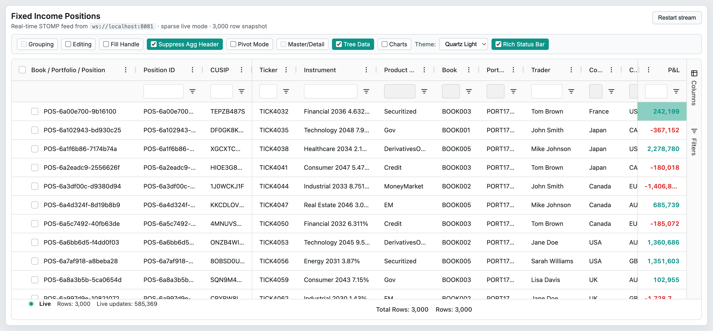

# 14 — Tree Data

## Concept

Tree Data allows AG Grid to display hierarchical (parent–child) data without explicit row grouping. Instead of grouping by column values, the hierarchy is expressed in the data itself. Module: `TreeDataModule` (Enterprise).

AG Grid supports three ways to express tree hierarchy:

| Strategy | Key options | Description |
|----------|-------------|-------------|
| Path-based | `treeData: true` + `getDataPath` | Each row provides its full path as `string[]`, e.g. `['Org', 'Dept', 'Person']`. |
| Children field | `treeData: true` + `treeDataChildrenField` | Each row has a field containing an array of child objects. |
| Parent ID | `treeData: true` + `treeDataParentIdField` + `getRowId` | Each row contains the ID of its parent; the grid builds the tree from relationships. |

All three strategies use the auto group column (or a custom column) to render the hierarchy with expand/collapse controls. Tree Data interacts with `groupDefaultExpanded`, `autoGroupColumnDef`, `groupDefaultExpanded`, and `suppressGroupRowsSticky` (see `09-row-grouping.md` for shared configuration).

Tree Data can be combined with the Server-Side Row Model (SSRM) for large hierarchies; see `15-server-side-row-model.md`.

## Configuration surface

| Option | Type | Default | Tier | Description |
|--------|------|---------|------|-------------|
| `treeData` | `boolean` | `false` | Enterprise | Enables Tree Data mode. `@agModule TreeDataModule`. |
| `getDataPath` | `GetDataPath<TData>` → `string[]` | `undefined` | Enterprise | Callback returning the full path array for a row; used with path-based strategy. |
| `treeDataChildrenField` | `string` | `undefined` | Enterprise | Field name on each row object containing an array of child objects. Supports dot notation. |
| `treeDataParentIdField` | `string` | `undefined` | Enterprise | Field name containing the parent row's ID. Requires `getRowId`. Supports dot notation. |
| `treeDataDisplayType` | `'auto' \| 'custom'` | `'auto'` | Enterprise | `'auto'` adds the group column automatically; `'custom'` lets you supply your own hierarchy column(s). |
| `autoGroupColumnDef` | `AutoGroupColumnDef<TData>` | `undefined` | Enterprise | Shared with row grouping — overrides the auto group column definition. In tree mode the column label defaults to "Group". |
| `groupDefaultExpanded` | `number` | `0` | Enterprise | Depth to expand by default. `-1` expands all levels. Applies to both grouping and tree data. |
| `suppressGroupRowsSticky` | `boolean` | `false` | Enterprise | Prevents group/tree rows from sticking to the top of the viewport when scrolled. `@agModule RowGroupingModule / TreeDataModule`. |

## API methods

Tree Data itself adds no dedicated API methods beyond those inherited from the Client-Side Row Model (see `03-row-models.md`). The standard row-model methods apply:

| Method | Signature | Tier | Description |
|--------|-----------|------|-------------|
| `applyTransaction` | `(transaction: RowDataTransaction<TData>) => RowNodeTransaction<TData> \| null` | Community | Add, remove, or update rows in the tree. AG Grid re-builds the affected subtree. |
| `applyTransactionAsync` | `(transaction: RowDataTransaction<TData>, callback?) => void` | Community | Queued transaction applied after `asyncTransactionWaitMillis`. |
| `forEachNode` | `(callback: (node: IRowNode, index: number) => void) => void` | Community | Iterates all nodes including group/tree nodes. |
| `forEachLeafNode` | `(callback: (node: IRowNode) => void) => void` | Community | Iterates only leaf (data) nodes. |
| `expandAll` | `() => void` | Community | Expands all tree nodes. |
| `collapseAll` | `() => void` | Community | Collapses all tree nodes. |
| `setRowNodeExpanded` | `(rowNode: IRowNode, expanded: boolean, expandParents?: boolean) => void` | Community | Programmatically expands or collapses a single node. |

For Tree Data + SSRM see `15-server-side-row-model.md` and the SSRM API (`refreshServerSide`, `applyServerSideTransaction`).

## Events

| Event | Payload | Tier | Fires when |
|-------|---------|------|-----------|
| `rowGroupOpened` | `RowGroupOpenedEvent { node: IRowNode; data: TData; expanded: boolean; ... }` | Community | A tree node is expanded or collapsed (same event as row-grouping expand). |
| `modelUpdated` | `ModelUpdatedEvent { animate: boolean; keepRenderedRows: boolean; newData: boolean; newPage: boolean }` | Community | Tree structure is rebuilt after a data change, sort, or filter. |

## Behaviors / interactions

### Path-based tree (`getDataPath`)

`getDataPath` returns a string array representing the node's position in the hierarchy. The grid infers parent nodes from shared path prefixes:

```typescript
// Row at path ['Sales', 'EMEA', 'Alice'] is a child of ['Sales', 'EMEA']
getDataPath: (data) => data.orgPath  // e.g. ['Sales', 'EMEA', 'Alice']
```

Intermediate path nodes that have no matching data row are created as "filler" nodes. Filler nodes have no row data and cannot be selected or edited.

### Children-field tree (`treeDataChildrenField`)

Each row object contains a `children` array (or whichever field `treeDataChildrenField` names). The grid recursively processes the children to build the tree. This strategy works well when the backend returns nested JSON.

### Parent-ID tree (`treeDataParentIdField`)

Each row has a field (e.g. `parentId`) pointing to another row's ID (as returned by `getRowId`). Rows with no matching parent ID become root-level nodes. This strategy works well with flat tables from relational databases.

### Auto group column in tree mode

With `treeDataDisplayType: 'auto'` (default), the grid inserts an auto group column showing the node's label and expand/collapse control. The label for each node comes from the last element of its path (path-based) or from the row's cell value for the group column field (children/parent-ID strategies). Customize with `autoGroupColumnDef`.

With `treeDataDisplayType: 'custom'`, you supply your own column(s) using `cellRenderer: 'agGroupCellRenderer'` with `showRowGroup: true`.

### `groupDefaultExpanded` in tree mode

Behaves identically to row grouping: `0` collapses all, `1` expands one level, `-1` expands everything. Applies on initial load and after full data reloads.

### Sorting and filtering with tree data

- **Sorting** applies to leaf nodes within each parent group. The group row itself is not re-ordered relative to its siblings by value sort; it stays in structural order unless `initialGroupOrderComparator` is provided.
- **Filtering** hides leaf nodes that do not match. Parent nodes are kept visible as long as at least one descendant passes the filter. A parent node with all descendants filtered out is hidden unless it passes the filter itself.
- `serverSideOnlyRefreshFilteredGroups` (see `15-server-side-row-model.md`) controls this behaviour in SSRM tree mode.

### Tree Data with SSRM

Set both `treeData: true` and `rowModelType: 'serverSide'`. The `IServerSideGetRowsRequest` carries `groupKeys` for the current path — an empty array requests root nodes; `['Org', 'Sales']` requests children of the "Sales" node under "Org". Return leaf or branch nodes from the server; the grid calls `getRows` again for each branch the user expands. See `15-server-side-row-model.md` for the full `IServerSideDatasource` contract.

### Transactions and tree data

`applyTransaction` supports add/remove/update for all three tree strategies. When adding rows:
- Path-based: new rows with new intermediate paths create filler nodes automatically.
- Parent-ID: the new row's parent must already exist in the grid.

Removing a parent row also removes all its descendants.

## Look & feel

 — Tree Data toggle ON; the grid shows the `getDataPath`-driven 3-level hierarchy (Book → Portfolio → Position) with expand/collapse chevrons in the auto-group column; group rows show the book and portfolio names as parent nodes.

## Canvas-port implications

- Tree Data hierarchy requires the canvas row-layout engine to maintain a depth-indexed row position list. Expanding/collapsing a node invalidates all row indices below the toggled node.
- Filler nodes (path-based, no data) need a distinct visual treatment (dimmed label, no selection, no edit).
- The auto group column cell renderer (`agGroupCellRenderer`) is DOM-coupled; the canvas port needs an equivalent that renders the expand arrow and indented label directly on the canvas using depth × indent-width pixels.
- `groupDefaultExpanded: -1` with a large tree is a performance concern — the canvas port should virtualise even in expanded state.
- SSRM tree mode (lazy expansion) maps well to a canvas tile/block system: only expanded branches are fetched and painted; collapsed subtrees are a single collapsed-row tile.
- Children-field and parent-ID strategies involve O(n) tree-building passes on the client; large trees should use the SSRM strategy.
