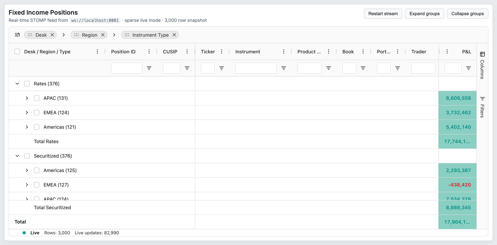

# 16 — Pinning & Layout

## Concept

AG Grid divides the horizontal viewport into three frozen-pane regions: **left pinned**, **center (scrollable)**, and **right pinned**. Columns assigned `pinned: 'left'` or `pinned: 'right'` are locked in their respective panes regardless of horizontal scrolling. Row pinning independently freezes data rows to the top or bottom of the scrollable body.

Vertical layout is controlled by `domLayout`, which determines whether the grid takes an explicit height (`normal`), expands to its content (`autoHeight`), or renders every row for print (`print`). Header-row heights—standard header, column-group header, floating-filter row, and pivot-mode variants—are individually configurable via dedicated options or inherited from the theme's `headerHeight` CSS variable.

Full-width rows (`isFullWidthRow` + `fullWidthCellRenderer`) span all three panes and are used for master/detail, loading overlays, and other cross-column UI.

Cross-reference: column-level pinning properties (`ColDef.pinned`, `ColDef.initialPinned`, `ColDef.lockPinned`) are documented in `02-column-model.md`.

## Configuration surface

### Column pinning (ColDef / API)

| Option | Type | Default | Tier | Description |
|--------|------|---------|------|-------------|
| `pinned` | `boolean \| 'left' \| 'right' \| null` | `undefined` | Community | Pins this column to the left or right frozen pane. `true` maps to `'left'`. |
| `initialPinned` | `boolean \| 'left' \| 'right'` | `undefined` | Community | Applied on first column creation only; ignored on subsequent updates. |
| `lockPinned` | `boolean` | `false` | Community | Prevents the user from changing the pinned state via UI (drag or column menu). |

### Row pinning

| Option | Type | Default | Tier | Description |
|--------|------|---------|------|-------------|
| `pinnedTopRowData` | `any[]` | `undefined` | Community | Static data rows frozen above the scrollable body. Requires `PinnedRowModule`. |
| `pinnedBottomRowData` | `any[]` | `undefined` | Community | Static data rows frozen below the scrollable body. Requires `PinnedRowModule`. |
| `enableRowPinning` | `boolean \| 'top' \| 'bottom'` | `undefined` | Community | Enables the row context-menu pin option. `true` allows top and bottom; `'top'`/`'bottom'` restricts direction. |
| `isRowPinnable` | `IsRowPinnable<TData>` | `undefined` | Community | Callback `(params: IsRowPinnableParams) => boolean`. Return `false` to prevent a specific row from being pinnable by the user. |

### DOM layout

| Option | Type | Default | Tier | Description |
|--------|------|---------|------|-------------|
| `domLayout` | `'normal' \| 'autoHeight' \| 'print'` | `'normal'` | Community | `normal` — grid uses container height with scrollbars. `autoHeight` — grid expands to full row count (no virtual rows). `print` — all rows rendered, no scrollbars; for print/PDF. |
| `ensureDomOrder` | `boolean` | `false` | Community | DOM row order matches display order. Disables row animations. Required for screen-reader row order. Initial. |
| `enableRtl` | `boolean` | `false` | Community | Right-to-left layout; mirrors column order and text alignment. Initial. |

### Header heights

| Option | Type | Default | Tier | Description |
|--------|------|---------|------|-------------|
| `headerHeight` | `number` | theme value | Community | Height in pixels for the column-label header row. |
| `groupHeaderHeight` | `number` | `headerHeight` | Community | Height for column-group header rows. |
| `floatingFiltersHeight` | `number` | theme value | Community | Height for the floating-filter row beneath the header. |
| `pivotHeaderHeight` | `number` | `headerHeight` | Community | Header height in pivot mode. |
| `pivotGroupHeaderHeight` | `number` | `groupHeaderHeight` | Community | Column-group header height in pivot mode. |
| `hidePaddedHeaderRows` | `boolean` | `false` | Community | Hide header rows that contain only empty padding groups. |

### Full-width rows

| Option | Type | Default | Tier | Description |
|--------|------|---------|------|-------------|
| `isFullWidthRow` | `IsFullWidthRow<TData>` | `undefined` | Community | Callback `(params: IsFullWidthRowParams) => boolean`. Return `true` for rows that should span all columns. |
| `fullWidthCellRenderer` | `any` | `undefined` | Community | Component rendered inside full-width rows. Receives the full row node as params. |
| `fullWidthCellRendererParams` | `any` | `undefined` | Community | Extra params passed to `fullWidthCellRenderer`. |
| `embedFullWidthRows` | `boolean` | `false` | Community | Embeds full-width rows in the main container so they scroll horizontally with normal rows. |

### Pinned-column overflow callback

| Option | Type | Default | Tier | Description |
|--------|------|---------|------|-------------|
| `processUnpinnedColumns` | `ProcessUnpinnedColumns<TData>` | `undefined` | Community | Called when the viewport is too narrow for all pinned columns. Return columns to unpin. Initial. |

## API methods

| Method | Signature | Tier | Description |
|--------|-----------|------|-------------|
| `setColumnsPinned` | `(keys: ColKey[], pinned: ColumnPinnedType) => void` | Community | Sets pinned state (`'left'`, `'right'`, or `null`) for the given columns. |
| `isPinning` | `() => boolean` | Community | Returns `true` if any column is currently pinned. |
| `isPinningLeft` | `() => boolean` | Community | Returns `true` if any column is pinned left. |
| `isPinningRight` | `() => boolean` | Community | Returns `true` if any column is pinned right. |
| `getDisplayedLeftColumns` | `() => Column[]` | Community | Returns the visible columns in the left pinned pane. |
| `getDisplayedCenterColumns` | `() => Column[]` | Community | Returns the visible columns in the center scrollable pane. |
| `getDisplayedRightColumns` | `() => Column[]` | Community | Returns the visible columns in the right pinned pane. |
| `getPinnedTopRowCount` | `() => number` | Community | Returns the number of rows pinned to the top. |
| `getPinnedBottomRowCount` | `() => number` | Community | Returns the number of rows pinned to the bottom. |
| `getPinnedTopRow` | `(index: number) => IRowNode \| undefined` | Community | Returns the row node at the given top-pinned index. |
| `getPinnedBottomRow` | `(index: number) => IRowNode \| undefined` | Community | Returns the row node at the given bottom-pinned index. |

## Events

| Event | Payload | Tier | Fires when |
|-------|---------|------|-----------|
| `columnPinned` | `ColumnPinnedEvent { pinned: ColumnPinnedType; columns: Column[]; source: ColumnEventType }` | Community | One or more columns are pinned or unpinned. |
| `pinnedRowDataChanged` | `PinnedRowDataChangedEvent<TData>` | Enterprise | `pinnedTopRowData` or `pinnedBottomRowData` grid option changes. |
| `pinnedRowsChanged` | `PinnedRowsChangedEvent<TData>` | Enterprise | The set of pinned rows changes (includes user-pinned rows when `enableRowPinning` is active). |

## Behaviors / interactions

**Three-pane sync-scroll:** Left and right pinned panes share a common vertical scroll position with the center pane but never scroll horizontally. Only the center viewport scrolls left/right.

**Pinned-column overflow:** When the viewport becomes narrower than the combined pinned-column widths, the grid calls `processUnpinnedColumns` (if provided) to determine which columns to move out of the pinned region. Without the callback, the rightmost pinned columns are removed first.

**`domLayout: 'autoHeight'` caveats:** Row virtualisation is disabled in `autoHeight` mode because the grid must render all rows to compute the container height. This mode should not be used with large datasets (thousands of rows). It is suitable for small in-page grids.

**`domLayout: 'print'`:** All rows and all columns are rendered simultaneously; virtualisation is fully off. Column widths revert to their defined `width` values rather than container-relative sizes. Used in combination with a print stylesheet or a PDF renderer.

**`enableRtl`:** Direction is applied to the grid wrapper via `dir="rtl"`. Pinned left/right semantics are preserved (left pinned columns appear on the visual right in RTL layout; right pinned columns appear on the visual left).

**`ensureDomOrder`:** Forces DOM row order to match visual order; required for AT row traversal. Has no effect on column order.

**Full-width rows and pinning:** Full-width rows span the entire width including pinned regions. They do not respond to individual column sizing or pinning events.

**Grand-total / group-total rows:** Set via `grandTotalRow: 'pinnedBottom' | 'pinnedTop' | 'top' | 'bottom'`. When `'pinnedBottom'` or `'pinnedTop'`, the row is rendered in the pinned row region and participates in `pinnedRowBorder` styling (see `21-themes-and-styling.md`).

## Look & feel

 — Grid showing the auto-group column and Position ID/CUSIP pinned left (57 cells), and P&L pinned right (19 cells), with the scrollable center viewport between them.

## Canvas-port implications

- The three-pane layout is the fundamental rendering split; the canvas engine must implement separate left, center, and right draw regions with independent horizontal scroll only in the center layer.
- `pinnedColumnBorder` and `pinnedRowBorder` CSS variables in the theming system correspond to visible dividers that the canvas port must draw explicitly rather than relying on CSS borders.
- `domLayout: 'autoHeight'` is a DOM-specific concept; the canvas port will naturally determine its own height from row data. Mapping this flag requires the canvas container to resize based on content height.
- `domLayout: 'print'` similarly needs a full-render mode in the canvas engine (no virtual rows/columns).
- `enableRtl` requires mirroring the canvas layout: column draw order reverses, and pin-pane positions swap visually.
- `isFullWidthRow` identifies rows that bypass the per-column rendering loop; the canvas port must handle these rows with a single full-width draw call spanning all regions.
- Header height overrides (`headerHeight`, `groupHeaderHeight`, etc.) must be exposed as layout constants in the canvas geometry calculations rather than inherited from CSS.
