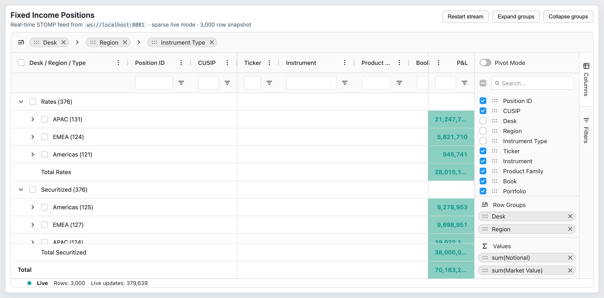
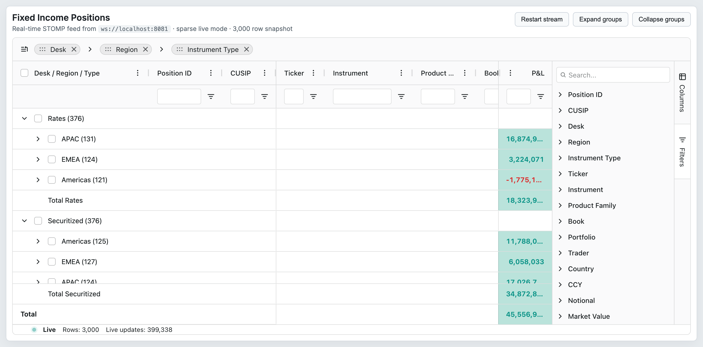

# 17 — Side Bar & Tool Panels

## Concept

The side bar is an Enterprise feature that attaches a collapsible panel strip to the right (or left) edge of the grid. Each panel is called a **tool panel** and is registered with a unique `id`. Built-in panels ship as `agColumnsToolPanel` (column visibility and grouping controls) and `agFiltersToolPanel` (filter controls per column). Custom tool panels implement `IToolPanelComp`.

The side bar is enabled via the `sideBar` grid option, which accepts a shorthand string (`'columns'`, `'filters'`) or a full `SideBarDef` object.

Cross-references: the Columns Tool Panel is tightly coupled to `02-column-model.md` (column visibility). The Filters Tool Panel reflects active filters from `08-filtering.md`.

## Configuration surface

### `sideBar` shorthand

| Option | Type | Default | Tier | Description |
|--------|------|---------|------|-------------|
| `sideBar` | `SideBarDef \| string \| string[] \| boolean \| null` | `undefined` | Enterprise | `'columns'` shows only the columns panel; `'filters'` shows only filters; `true` shows both; `false`/`null` hides the side bar. Full object gives complete control. Requires `SideBarModule`. |

### `SideBarDef` object

| Option | Type | Default | Tier | Description |
|--------|------|---------|------|-------------|
| `toolPanels` | `(ToolPanelDef \| string)[]` | `[]` | Enterprise | Ordered list of tool panel definitions. Strings `'columns'` and `'filters'` expand to built-in defaults. |
| `defaultToolPanel` | `string` | `undefined` | Enterprise | ID of the panel to open on initial render. Omit to start collapsed. |
| `hiddenByDefault` | `boolean` | `false` | Enterprise | Side bar is rendered but collapsed by default. |
| `position` | `'left' \| 'right'` | `'right'` | Enterprise | Which edge of the grid the side bar attaches to. |
| `hideButtons` | `boolean` | `false` | Enterprise | Hides the side-bar tab buttons while still allowing programmatic open/close. |

### `ToolPanelDef` object

| Option | Type | Default | Tier | Description |
|--------|------|---------|------|-------------|
| `id` | `string` | required | Enterprise | Unique identifier used by the API and events. |
| `labelDefault` | `string` | required | Enterprise | Default label shown on the side-bar button. |
| `labelKey` | `string` | required | Enterprise | Locale key used to look up a translated label. |
| `iconKey` | `string` | required | Enterprise | Icon identifier for the side-bar button (e.g. `'columns'`, `'filter'`). |
| `toolPanel` | `any` | `undefined` | Enterprise | Component string name or component class. Built-ins: `'agColumnsToolPanel'`, `'agFiltersToolPanel'`. |
| `toolPanelParams` | `any` | `undefined` | Enterprise | Params forwarded to the tool panel component's `init()`. |
| `minWidth` | `number` | `100` | Enterprise | Minimum width of the panel in pixels. |
| `maxWidth` | `number` | `undefined` | Enterprise | Maximum width of the panel in pixels. |
| `width` | `number` | theme `$side-bar-panel-width` | Enterprise | Initial width of the panel in pixels. |
| `parent` | `HTMLElement \| null` | `undefined` | Enterprise | Mount the panel into an external DOM element rather than inside the grid. |

### Columns Tool Panel params (`IToolPanelColumnCompParams`)

| Option | Type | Default | Tier | Description |
|--------|------|---------|------|-------------|
| `suppressColumnMove` | `boolean` | `false` | Enterprise | Disables drag-to-reorder within the panel. |
| `suppressRowGroups` | `boolean` | `false` | Enterprise | Hides the Row Groups section. |
| `suppressValues` | `boolean` | `false` | Enterprise | Hides the Values (aggregation) section. |
| `suppressPivots` | `boolean` | `false` | Enterprise | Hides the Column Labels (pivot) section. |
| `suppressPivotMode` | `boolean` | `false` | Enterprise | Hides the Pivot Mode toggle. |
| `suppressColumnFilter` | `boolean` | `false` | Enterprise | Hides the column search/filter input. |
| `suppressColumnSelectAll` | `boolean` | `false` | Enterprise | Hides the select-all / deselect-all widget. |
| `suppressColumnExpandAll` | `boolean` | `false` | Enterprise | Hides the expand-all / collapse-all widget. |
| `contractColumnSelection` | `boolean` | `false` | Enterprise | Column groups start collapsed. |
| `suppressSyncLayoutWithGrid` | `boolean` | `false` | Enterprise | Prevents the panel from reordering when columns are reordered in the grid. |
| `buttons` | `('apply' \| 'cancel')[]` | `undefined` | Enterprise | Show Apply/Cancel buttons; changes are deferred until Apply is clicked. |

### Filters Tool Panel params (`IToolPanelFiltersCompParams`)

| Option | Type | Default | Tier | Description |
|--------|------|---------|------|-------------|
| `suppressExpandAll` | `boolean` | `false` | Enterprise | Hides the expand/collapse-all button. |
| `suppressFilterSearch` | `boolean` | `false` | Enterprise | Hides the filter search input. |
| `suppressSyncLayoutWithGrid` | `boolean` | `false` | Enterprise | Panel does not reorder when columns change order in the grid. |

### `allowDragFromColumnsToolPanel`

| Option | Type | Default | Tier | Description |
|--------|------|---------|------|-------------|
| `allowDragFromColumnsToolPanel` | `boolean` | `false` | Enterprise | Allows dragging columns from the Columns Tool Panel directly into the grid. Requires `ColumnsToolPanelModule`. |

## API methods

| Method | Signature | Tier | Description |
|--------|-----------|------|-------------|
| `isSideBarVisible` | `() => boolean` | Enterprise | Returns `true` if the side bar is currently visible (expanded). |
| `setSideBarVisible` | `(show: boolean) => void` | Enterprise | Shows or hides the side bar. |
| `setSideBarPosition` | `(position: 'left' \| 'right') => void` | Enterprise | Moves the side bar to the left or right edge. |
| `openToolPanel` | `(key: string, parent?: HTMLElement \| null) => void` | Enterprise | Opens the tool panel with the given ID. |
| `closeToolPanel` | `() => void` | Enterprise | Closes the currently open tool panel. |
| `getOpenedToolPanel` | `() => string \| null` | Enterprise | Returns the ID of the currently open panel, or `null` if collapsed. |
| `isToolPanelShowing` | `() => boolean` | Enterprise | Returns `true` if any tool panel is currently open and visible. |
| `refreshToolPanel` | `() => void` | Enterprise | Triggers `IToolPanel.refresh()` on the active panel with current params. |
| `getToolPanelInstance` | `(key: string) => IToolPanel \| undefined` | Enterprise | Returns the live tool panel component instance for the given ID. |

## Events

| Event | Payload | Tier | Fires when |
|-------|---------|------|-----------|
| `toolPanelVisibleChanged` | `ToolPanelVisibleChangedEvent { visible: boolean; key: string; source: 'sideBarButtonClicked' \| 'sideBarInitializing' \| 'api'; switchingToolPanel: boolean }` | Enterprise | A tool panel is shown or hidden, or the user switches between panels. |
| `toolPanelSizeChanged` | `ToolPanelSizeChangedEvent { started: boolean; ended: boolean; width: number }` | Enterprise | The user resizes a tool panel by dragging its edge. |

## Behaviors / interactions

**Shorthand expansion:** The string shorthand `'columns'` expands to a `SideBarDef` containing a single `ToolPanelDef` with `id: 'columns'`, `toolPanel: 'agColumnsToolPanel'`, and the default icon and labels. `'filters'` does the same for `agFiltersToolPanel`. `true` produces both. This expansion is performed by `sideBarDefParser`.

**Column Tool Panel ↔ grid sync:** By default, dragging a column in the Columns Tool Panel reorders it in the grid immediately. Setting `suppressSyncLayoutWithGrid: true` decouples them. When `buttons: ['apply']` is set, all changes (visibility, grouping) are deferred until the user clicks Apply.

**Custom tool panels:** Any component implementing `IToolPanelComp` (which extends `IComponent<IToolPanelParams>` and `IToolPanel`) can be registered. The `refresh(params)` method is called whenever `api.refreshToolPanel()` is invoked or when the `sideBar` grid option is updated. Return `true` from `refresh` to signal that the panel handled the update without needing recreation.

**State persistence:** The `SideBarState` (which panel is open, panel widths) is included in the grid state snapshot returned by `api.getState()`. Pass it back via `initialState` to restore on mount.

**`hideButtons: true`:** Useful when you want a tool panel to show on load (`defaultToolPanel`) without the tab strip occupying space, controlled entirely via the API.

## Look & feel

 — Side bar with the Columns tab active, showing the full column list with checkboxes, row-group and value-aggregation drop-zones.

 — Side bar with the Filters tab active, listing all filterable columns with their current filter status.

## Canvas-port implications

- The side bar is an Enterprise widget that attaches to the DOM outside the canvas surface. It can be retained as a DOM overlay in the canvas port without direct canvas integration.
- The Columns Tool Panel drives column visibility/ordering via `setColumnsVisible` and `applyColumnState`; the canvas port must implement equivalent API methods to support this.
- The Filters Tool Panel surfaces filter controls; the canvas port's filter model must be compatible with the same `IFilterComp` contract so tool-panel filter components can interact with canvas grid state.
- `getToolPanelInstance` enables embedding custom logic (e.g. selecting a column programmatically from a tool panel); the canvas port should support this pattern via its own side-bar API.
- `toolPanelSizeChanged` affects the available width for the center pane; the canvas engine must respond to side bar resize events to recalculate viewport width.
