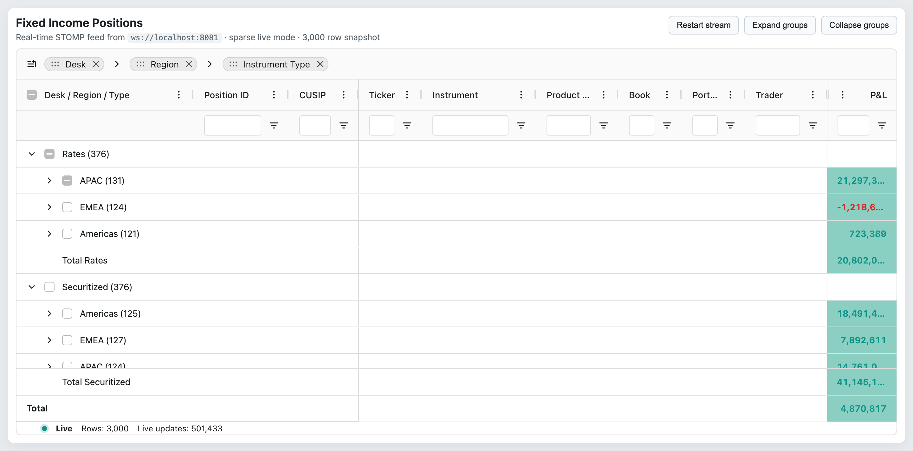
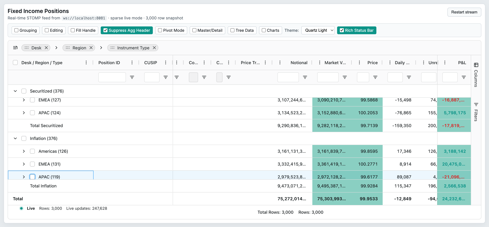

# 18 — Status Bar

## Concept

The status bar is an Enterprise widget that renders a horizontal strip below the grid body. It hosts one or more **status panel** components arranged in left, center, and right zones. Built-in panels report row counts and aggregation values for the current selection or filter state. Custom panels implement `IStatusPanelComp`.

The status bar is configured via the `statusBar` grid option (requires `StatusBarModule`).

## Configuration surface

### `statusBar` option

| Option | Type | Default | Tier | Description |
|--------|------|---------|------|-------------|
| `statusBar` | `StatusBar` | `undefined` | Enterprise | Object containing `statusPanels: StatusPanelDef[]`. Requires `StatusBarModule`. |

### `StatusPanelDef`

| Option | Type | Default | Tier | Description |
|--------|------|---------|------|-------------|
| `statusPanel` | `any` | required | Enterprise | Component class, component function, or string key for the panel. |
| `key` | `string` | `undefined` | Enterprise | Unique key used to retrieve the instance via `api.getStatusPanel()`. |
| `align` | `'left' \| 'center' \| 'right'` | `'right'` | Enterprise | Zone in the status bar where this panel is placed. |
| `statusPanelParams` | `any` | `undefined` | Enterprise | Params forwarded to the panel's `init()` / constructor. |

### Built-in panel components

| Option | Type | Default | Tier | Description |
|--------|------|---------|------|-------------|
| `'agTotalRowCountComponent'` | string key | — | Enterprise | Displays the total number of rows in the grid. |
| `'agFilteredRowCountComponent'` | string key | — | Enterprise | Displays the number of rows currently passing the active filter. |
| `'agSelectedRowCountComponent'` | string key | — | Enterprise | Displays the count of rows in the current row selection. |
| `'agTotalAndFilteredRowCountComponent'` | string key | — | Enterprise | Displays both total and filtered counts in one panel. |
| `'agAggregationComponent'` | string key | — | Enterprise | Shows count, sum, min, max, avg for the current range selection or row selection. Requires `CellSelectionModule` or `RowSelectionModule` for meaningful values. |

### `IAggregationStatusPanelParams`

| Option | Type | Default | Tier | Description |
|--------|------|---------|------|-------------|
| `aggFuncs` | `AggregationStatusPanelAggFunc[]` | all | Enterprise | Restrict which aggregation functions are shown: `'count'`, `'sum'`, `'min'`, `'max'`, `'avg'`. |
| `valueFormatter` | `(params: IStatusPanelValueFormatterParams) => string` | `undefined` | Enterprise | Custom formatter for the aggregated values displayed by the panel. |

## API methods

| Method | Signature | Tier | Description |
|--------|-----------|------|-------------|
| `getStatusPanel` | `<TStatusPanel = IStatusPanel>(key: string) => TStatusPanel \| undefined` | Enterprise | Returns the live status panel component instance for the given key. Useful for calling component-specific methods. |

## Events

The status bar does not emit dedicated events. It reacts to grid-level events internally (`selectionChanged`, `filterChanged`, `rowDataUpdated`, `rangeSelectionChanged`) to update displayed values. Custom panels can subscribe to any grid event via `params.api.addEventListener`.

| Event | Payload | Tier | Fires when |
|-------|---------|------|-----------|
| _(none dedicated to status bar)_ | — | — | Custom panels observe grid events directly via `params.api`. |

## Behaviors / interactions

**Zone layout:** The `align` field places panels in left, center, or right flex containers. Multiple panels in the same zone stack horizontally in definition order.

**`agAggregationComponent` triggers:** The aggregation panel shows values whenever a cell range is selected (Enterprise range selection) or rows are selected. When neither condition applies, the panel shows nothing. Restrict displayed functions via `aggFuncs` in `statusPanelParams` to control visual density.

**Custom panels lifecycle:** A custom `IStatusPanelComp` implements `IComponent<IStatusPanelParams>` (providing `init(params)` and `getGui()`) plus the optional `refresh(params): boolean` hook. Returning `true` from `refresh` prevents the panel being destroyed and re-created when `statusBar` is updated.

**Panel retrieval:** Use `getStatusPanel(key)` to reach a custom panel's public API. Requires `key` to be set in `StatusPanelDef`.

**Live data refresh:** The showcase (`PositionsGrid.tsx`) passes a memoized `statusBar` object whose `StatusPanelDef.statusPanel` is a React component receiving live `feed` and `totalRows` props. Because `statusBar` is wrapped in `useMemo`, the grid receives a new reference only when the dependency changes, causing the panel to re-render.

## Look & feel

 — Status bar showing the custom live-feed panel (left: phase, row count, update count) and the agAggregationComponent (right) populated with sum/avg/min/max for the 5 selected rows.
-  — Rich Status Bar mode showing `agTotalRowCountComponent`, `agFilteredRowCountComponent`, `agSelectedRowCountComponent`, `agAggregationComponent`, and the custom phase panel together.

## Canvas-port implications

- The status bar is a DOM strip below the canvas surface; it can be retained as a pure DOM component in the canvas port without drawing into the canvas.
- The aggregation panel consumes `rangeSelectionChanged` events, which require the Enterprise range selection model. The canvas port must expose an equivalent event to keep built-in status panels functional.
- Custom status panels that call `params.api.*` methods need the canvas port's `GridApi` to be API-compatible for at least `getSelectedRows()`, `getSelectedNodes()`, and filter/row-count queries.
- The showcase uses a custom React panel to display STOMP feed health — this pattern (custom status panel as a React component) works in the canvas port only if the port mounts React components in its status bar zone.
