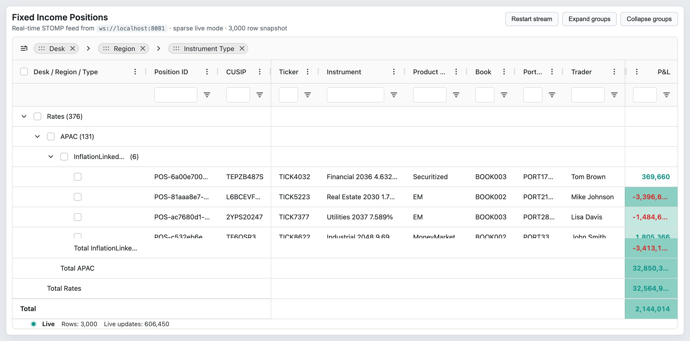
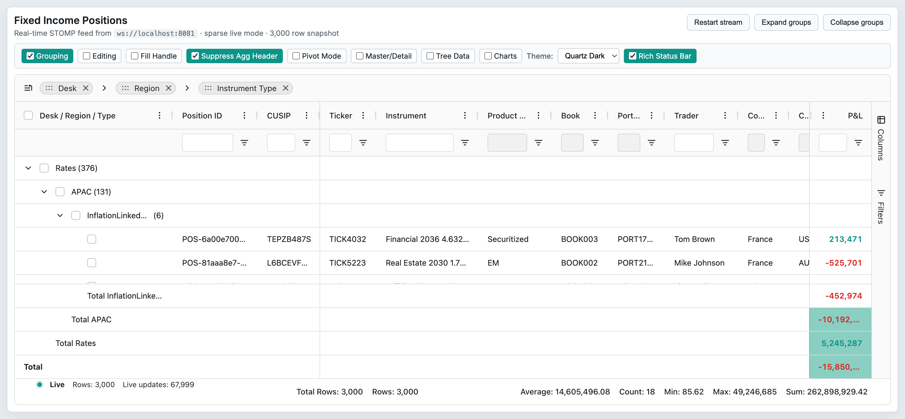
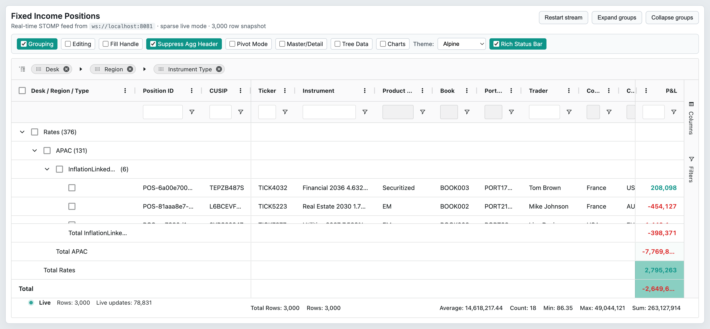
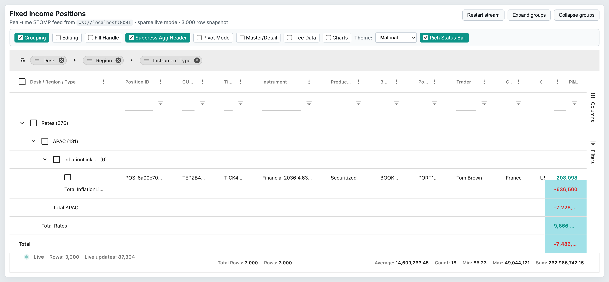

# 21 — Themes & Styling

## Concept

AG Grid 35.x ships a new **Theming API** (introduced in v33) that replaces the legacy CSS-file / class-name approach. A theme is a typed TypeScript object created from built-in theme factories (`themeQuartz`, `themeAlpine`, `themeBalham`, `themeMaterial`) or the low-level `createTheme()`. Themes are parameterised via `withParams()` (changing CSS variable values) and composable via `withPart()` (replacing design sub-systems like icon sets, checkbox styles, color schemes).

The legacy approach — importing `ag-theme-quartz.css` and setting `class="ag-theme-quartz"` on the wrapper — is still available by setting `theme: 'legacy'` in grid options, but is not recommended for new projects.

Cell-level styling (independent of the grid theme) is applied in precedence order: `cellClass` → `cellClassRules` → `cellStyle`, mirroring CSS specificity. These are documented in `02-column-model.md` and cross-referenced here.

## Configuration surface

### Theme grid options

| Option | Type | Default | Tier | Description |
|--------|------|---------|------|-------------|
| `theme` | `Theme \| 'legacy'` | `themeQuartz` | Community | The theme object to apply, or `'legacy'` to opt into the v32 CSS class approach. |
| `loadThemeGoogleFonts` | `boolean` | `false` | Community | Automatically load Google Fonts declared in the theme (e.g. Inter for Quartz) from Google's CDN. |
| `themeCssLayer` | `string` | `undefined` | Community | Wraps generated theme CSS in a `@layer <name> { }` block for cascade layer control. Pair with `themeStyleContainer: document.body`. |
| `styleNonce` | `string` | `undefined` | Community | Sets a `nonce` attribute on `<style>` elements injected by the theme, enabling the CSP `style-src 'nonce-<value>'` directive. |
| `themeStyleContainer` | `HTMLElement \| (() => HTMLElement \| void)` | `document.head` | Community | Element into which theme `<style>` tags are inserted. Use `document.body` with `themeCssLayer` or for shadow DOM support. Initial. |

### Built-in theme objects

| Theme | Type | Default | Tier | Description |
|-------|------|---------|------|-------------|
| `themeQuartz` | `Theme<ThemeDefaultParams>` | N/A | Community | Default modern theme with rounded corners and the Inter font. `@default` for `theme` option. |
| `themeAlpine` | `Theme<ThemeDefaultParams>` | N/A | Community | Clean theme with blue accents and a subtle focus shadow. |
| `themeBalham` | `Theme<ThemeDefaultParams>` | N/A | Community | Compact spreadsheet-like theme with striped rows and bold headers. |
| `themeMaterial` | `Theme<ThemeDefaultParams & StyleMaterialParams>` | N/A | Community | Material Design–inspired theme; requires `styleMaterial` part and adds `primaryColor` param. |

### Theme API methods

| Method | Signature | Tier | Description |
|--------|-----------|------|-------------|
| `withParams` | `(defaults: Partial<TParams>, mode?: string) => Theme<TParams>` | Community | Returns a new theme with overridden default values for the listed params. Pass a `mode` string (`'light'`, `'dark'`, or custom) to apply the params only in that color-scheme context. |
| `withPart` | `<TPartParams>(part: Part<TPartParams> \| (() => Part<TPartParams>)) => Theme<TParams & TPartParams>` | Community | Returns a new theme that uses the given part, replacing any existing part for the same design feature. |
| `withoutPart` | `(feature: string) => Theme<TParams>` | Community | Returns a new theme with the named part removed. |
| `createTheme` | `() => Theme<CoreParams & ButtonStyleParams & ...>` | Community | Factory for a blank theme containing only core grid styles and no design parts. Start from here for fully custom themes. |

### Key theme parameters (excerpt from `SharedThemeParams` and `CoreParams`)

| Parameter | Type | Tier | Description |
|-----------|------|------|-------------|
| `accentColor` | `ColorValue` | Community | Brand color for selections, focus rings, and checkboxes. |
| `backgroundColor` | `ColorValue` | Community | Grid background; semi-transparent UI elements blend with this. |
| `foregroundColor` | `ColorValue` | Community | Base neutral color; most text, borders, and backgrounds derive from this. |
| `borderColor` | `ColorValue` | Community | Default border color. |
| `borderRadius` | `LengthValue` | Community | Corner radius for menus, dialogs, and widgets. |
| `chromeBackgroundColor` | `ColorValue` | Community | Headers, tool panels, and menus background. |
| `spacing` | `LengthValue` | Community | Base spacing unit; all padding and margins are multiples of this. |
| `fontSize` | `LengthValue` | Community | Default font size throughout the grid. |
| `fontFamily` | `FontFamilyValue` | Community | Default font family. Accepts Google Font descriptor `{ googleFont: 'Inter' }`. |
| `headerHeight` | `LengthValue` | Community | Height of the column header row (theme default; overridden by `gridOptions.headerHeight`). |
| `rowHeight` | `LengthValue` | Community | Height of data rows (theme default; overridden by `gridOptions.rowHeight` or `getRowHeight`). |
| `oddRowBackgroundColor` | `ColorValue` | Community | Alternating row stripe color. |
| `rowHoverColor` | `ColorValue` | Community | Row background on mouse hover. |
| `headerBackgroundColor` | `ColorValue` | Community | Header cell background. |
| `headerFontFamily` | `FontFamilyValue` | Community | Header cell font family. |
| `headerFontSize` | `LengthValue` | Community | Header cell font size. |
| `headerFontWeight` | `FontWeightValue` | Community | Header cell font weight. |
| `headerTextColor` | `ColorValue` | Community | Header cell text color. |
| `cellHorizontalPadding` | `LengthValue` | Community | Left/right padding inside body and header cells. |
| `pinnedColumnBorder` | `BorderValue` | Community | Divider line between pinned and center column regions. |
| `pinnedRowBorder` | `BorderValue` | Community | Divider line between pinned and scrollable row regions. |
| `focusShadow` | `ShadowValue` | Community | Box-shadow on focused form inputs and buttons. |
| `rangeSelectionBorderColor` | `ColorValue` | Community | Border color around range selections. |
| `rangeSelectionBackgroundColor` | `ColorValue` | Community | Background fill for range selections (semi-transparent recommended). |
| `menuBackgroundColor` | `ColorValue` | Community | Background of context menu and column menu. |
| `menuShadow` | `ShadowValue` | Community | Shadow on menus. |
| `browserColorScheme` | `ColorSchemeValue` | Community | CSS `color-scheme` applied to the grid; controls browser scrollbar and input default appearance. |
| `wrapperBorderRadius` | `LengthValue` | Community | Corner radius of the grid wrapper element. |

### Cell styling (ColDef — cross-reference)

Cell-level styling is applied per-cell and evaluated on each render. Precedence: `cellClass` (lowest) → `cellClassRules` → `cellStyle` (highest for inline style). Full documentation in `02-column-model.md`.

| Property | Type | Tier | Description |
|----------|------|------|-------------|
| `cellClass` | `string \| string[] \| CellClassFunc<TData, TValue>` | Community | Static or computed CSS class(es) on body cells. |
| `cellClassRules` | `CellClassRules<TData, TValue>` | Community | Map of CSS class → predicate function; class applied when predicate returns true. |
| `cellStyle` | `CellStyle \| CellStyleFunc<TData, TValue>` | Community | Inline style object applied to body cells. Highest visual specificity among cell styling options. |

### Dark mode

Dark mode is achieved by calling `withParams({ ... }, 'dark')` on a theme. The grid applies the dark params when the CSS `prefers-color-scheme: dark` media query matches, or when `browserColorScheme: 'dark'` is set unconditionally.

### `renderingMode`

| Option | Type | Default | Tier | Description |
|--------|------|---------|------|-------------|
| `renderingMode` | `'default' \| 'legacy'` | `'default'` | Community | **Deprecated v35 path.** Controls the internal rendering pipeline. Do not set unless advised by AG Grid support. |

## API methods

The Theming API has no runtime grid API methods — themes are configured at grid creation and updated via `api.updateGridOptions({ theme: newTheme })`.

| Method | Signature | Tier | Description |
|--------|-----------|------|-------------|
| `updateGridOptions` | `(options: Partial<GridOptions<TData>>) => void` | Community | Pass `{ theme: ... }` to apply a different theme at runtime. The grid replaces the `<style>` elements immediately. |
| `refreshCells` | `(params?: RefreshCellsParams) => void` | Community | Forces re-evaluation of `cellClass`, `cellClassRules`, and `cellStyle` for the given cells. |

## Events

The theming system does not emit dedicated events.

| Event | Payload | Tier | Fires when |
|-------|---------|------|-----------|
| _(none dedicated)_ | — | — | Theme changes via `updateGridOptions` trigger internal re-styling without a public event. |

## Behaviors / interactions

**Theme object immutability:** `withParams()` and `withPart()` always return new `Theme` objects; they do not mutate the original. `themeQuartz` can be imported and customised without affecting other grids on the page.

**CSS variables:** The Theming API compiles theme params to `--ag-*` CSS custom properties scoped to the grid's wrapper element. Applications can also set `--ag-*` variables in CSS, but this lower-level override is less typed and not recommended when the Theming API is in use.

**Mode-conditional params:** `withParams(params, 'light')` / `withParams(params, 'dark')` allow the same theme object to have different colours in light and dark modes. AG Grid generates the appropriate `@media (prefers-color-scheme: dark)` or attribute-based selector automatically.

**Part replacement:** Parts encapsulate a design sub-system (e.g. `colorSchemeLight`, `iconSetQuartz`, `inputStyleUnderlined`). Calling `withPart(colorSchemeDark)` swaps out the entire color scheme while preserving all other theme params.

**`cellStyle` precedence:** When `cellClass` and `cellStyle` both set the same CSS property, `cellStyle` wins because it is applied as an inline style (highest specificity). `cellClassRules`-applied classes sit between: they are applied after static `cellClass` values but before `cellStyle`.

**Row height and theme `rowHeight`:** The theme-level `rowHeight` param sets the CSS variable that the grid uses for its internal row height calculations. When `gridOptions.rowHeight` (a pixel number) is set, it overrides the theme variable for all rows. `getRowHeight` (per-row callback) overrides both for individual rows. This three-tier system means themes control the default but grid options and row callbacks have priority.

**Legacy theming (`theme: 'legacy'`):** Set the option to `'legacy'` and import the CSS file (`ag-grid.css` + `ag-theme-quartz.css`). Apply the class `ag-theme-quartz` to the grid wrapper. This mode is supported in v35 but receives no new feature development.

## Look & feel

 — Showcase grid in its clean default state using `themeQuartz` with custom teal accent (`#0d9488`), Inter font, and light Quartz color scheme showing grouped rows and the status bar.

 — Same showcase grid switched to `themeQuartz` dark variant via the Theme dropdown; dark background with teal accent highlights on selection and header elements.

 — Grid using the `themeAlpine` preset; clean white rows with a blue accent, slightly larger default row height, and the Alpine-style compact header.

 — Grid using the `themeMaterial` preset; Material Design–inspired elevated header, roboto-style typography, and blue ripple accent on focused/selected cells.

## Canvas-port implications

- CSS-variable–based theming (`--ag-*`) is irrelevant to canvas rendering; the canvas port needs a parallel **design token system** that maps the same conceptual tokens (accent color, row height, cell padding, etc.) to drawing primitives (fill colors, line widths, font metrics).
- `themeQuartz.withParams(...)` is already in use in the showcase (`PositionsGrid.tsx`) to set `accentColor`, `backgroundColor`, `fontFamily`, `fontSize`, `rowHeight`-linked params, and more. The canvas port must read at minimum this param set.
- `cellClass` / `cellClassRules` / `cellStyle` apply to DOM elements; in the canvas port these become per-cell style resolver functions that produce fill, stroke, and font overrides for the 2D drawing context. The precedence order must be preserved.
- `pinnedColumnBorder` and `pinnedRowBorder` tokens map directly to lines the canvas engine draws between pane regions; they should be first-class drawing params rather than derived from CSS.
- Dark mode support in the canvas port requires conditional token sets evaluated at draw time rather than CSS media queries. `withParams({...}, 'dark')` semantics should inform the canvas token resolution strategy.
- `refreshCells()` has a canvas equivalent: invalidate the cell regions and schedule a re-draw. The trigger contract (which cells are re-evaluated) must be identical so `cellClassRules` updates work the same way.
