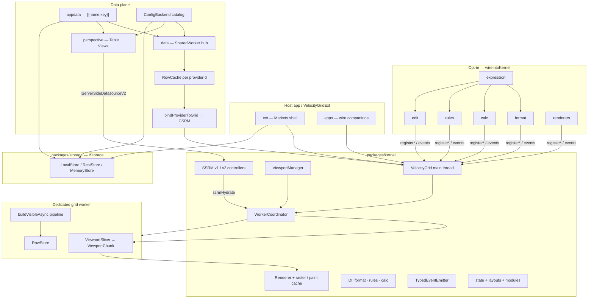
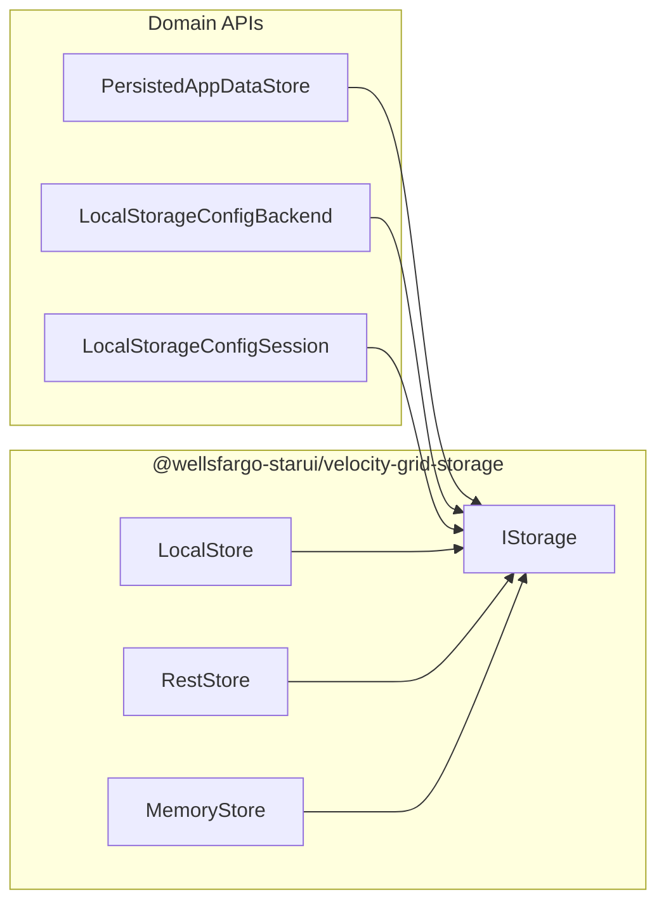

# VelocityGrid — Architecture & Implementation Approach

**Scope:** How VelocityGrid is built — topology, main/worker split, CSRM/SSRM data paths, companion bridges, and design principles.  
**Feature catalog:** [velocity-grid-feature-reference.md](./velocity-grid-feature-reference.md)  
**UI chrome:** [velocity-grid-ext-feature-reference.md](./velocity-grid-ext-feature-reference.md) · [data-provider-editor-feature-reference.md](./data-provider-editor-feature-reference.md)  
**Config planes / storage:** [starui-platform/03-config-planes.md](./starui-platform/03-config-planes.md)  
**Baseline:** `packages/*` on `main`

---

## 1. Design principles

1. **Canvas cells, DOM chrome** — Row/cell paint is canvas (throughput, uniform styling). DOM is reserved for overlays (editors, filters, side bar, menus).
2. **AG-Grid-like API surface** — Familiar options, events, SSRM shapes (`types/options.ts`, `types/api.ts`) without shipping AG Grid as a runtime.
3. **Acyclic monorepo** — Kernel has **zero** runtime imports of companions. Companions take `grid` and register via public DI slots / events. Kernel lists companions as **devDependencies** for tests only.
4. **CSP-safe expression DSL** — `packages/expression` compiles to closures (no user-string `eval` / `new Function` on main). Worker calc programs use static interpreter sources (documented CSP caveat for worker `unsafe-eval` where required).
5. **Row-model split** — **CSRM:** full worker pipeline owns filter/sort/group/pivot/agg/calc. **SSRM:** server/Perspective owns query shape; worker holds a sparse paint window (unless client-side pipeline is enabled).
6. **Two calc dialects by design** — CSRM uses `[col]` + `packages/calc` in the worker; SSRM uses **Perspective ExprTK** on the View. Do not conflate.
7. **Markets-shaped composition** — Ext + data catalog + AppData + Perspective compose blotter product planes; chrome stays out of the kernel.
8. **One persistence transport** — AppData, provider catalog, and Ext ConfigSession share `@wellsfargo-starui/velocity-grid-storage` (`IStorage`); domain APIs stay separate. Default `LocalStore`; hosts swap `RestStore` for backend KV.
9. **Intentionally deferred** — `packages/export` and `packages/excel-pivot` are scaffolds; infinite / tree-data / master-detail / advanced-filter UI are absent from kernel.

---

## 2. System topology



**Runtime layers (ASCII):**

```
┌─────────────────────────────────────────────────────────────────┐
│ Host: apps / VelocityGridExt (chrome, ConfigSession, catalog)   │
│       shared IStorage (LocalStore | RestStore)                  │
└────────────────────────────┬────────────────────────────────────┘
                             │ construct + wire*
┌────────────────────────────▼────────────────────────────────────┐
│ MAIN: VelocityGrid                                              │
│  canvas paint │ events │ options │ SSRM cache │ DI slots        │
│  ViewportManager ──dispatch──► WorkerCoordinator                │
└───────────────┬────────────────────────────┬────────────────────┘
                │ postMessage                │ getRows / hydrate
┌───────────────▼──────────────┐   ┌─────────▼────────────────────┐
│ WORKER: RowStore + pipeline  │   │ data hub OR Perspective book │
│ filter→group→pivot→calcB→sort│   │ SharedWorker / WASM Table    │
│ → ViewportChunk              │   └──────────────────────────────┘
└──────────────────────────────┘
```

---

## 3. Package roles & wiring

| Package | Role | How it attaches |
|---------|------|-----------------|
| **kernel** | Canvas engine, CSRM/SSRM, worker, paint, AG-like API | Host constructs `new VelocityGrid(el, opts)` |
| **expression** | Leaf DSL (parse/compile/eval/validate) | Imported by format/calc/rules/edit — never by kernel |
| **format** | Format DSL compiler | `wireIntoKernel` → `registerFormatCompiler` + Lucide icons |
| **calc** | CSRM calculated columns + aggregates/`PREV` | `wireIntoKernel` → `registerCalcProvider` + state module |
| **rules** | Conditional style / flash / alerts | `wireIntoKernel` → `registerRuleEngine` + event push + state |
| **edit** | Smart/bulk/±/shortcuts/journal | `wireEditIntoKernel` → main-thread ops → `applyTransaction` |
| **renderers** | Named canvas painters | `wireRenderersIntoKernel` → `registerCellRenderer` |
| **data** | CSRM SharedWorker hub + transports | `bindProviderToGrid` → `setRowData` / `applyTransaction(Async)` |
| **perspective** | SSRM Table/View + ExprTK | `attach(grid)` / SSRM DS + `setSsrmExpressionHost` |
| **appdata** | `{{name.key}}` bags | Used by data + perspective config resolve |
| **customizer** | Lit edit-settings tool panels | Kernel `components` / sideBar tool panels |
| **ext** | Markets shell | Composes wires + chrome around kernel |

**Typical app wire order:** format → calc → rules → (optional) edit / renderers → data bind **or** Perspective attach.  
Calc format strings need the format compiler registered first. Bridges are **idempotent** (`__formatBridgeWired`, `__calcBridgeWired`, …).

---

## 4. Kernel internals

### 4.1 Source map (`packages/kernel/src`)

| Area | Path | Responsibility |
|------|------|----------------|
| Facade | `velocityGrid.ts` | Construction, public API, orchestration |
| Core | `core/` | Canvas host, layout, viewport, worker coord, SSRM, columns, flash, damage, options, persistence |
| Worker | `worker/` | Entry, protocol, passes, handlers, chunk format |
| Paint | `renderer/` | Paint pipeline, cell registry, raster caches, painters |
| Interaction | `interaction/` | Features, filter UI, editors, sideBar, statusBar, menus (DOM overlays) |
| Theme | `theming/` | Theme object, CSS tokens |
| Types | `types/` | Options, API, SSRM, events, columns |
| DI slots | `core/{formatCompiler,ruleEngine,calc}Slot.ts` | Companion registration |

### 4.2 Main vs worker

| Main thread | Worker |
|-------------|--------|
| Single canvas + hit-testing | `RowStore` (source of truth for CSRM) |
| Overlays (editors, filters, menus) | `buildVisibleAsync` pipeline |
| `ViewportManager`, SSRM block/skeleton cache | Viewport slicing → `ViewportChunk` |
| Event bus, options, persistence | Async `TransactionQueue` |
| Paint / raster / damage | Flash diffs packing |
| Companion DI slots; main-only hooks (`doesExternalFilterPass`, `postSortRows`, …) | Filter/sort/group/pivot/agg/calc passes |

Bridge: `core/workerCoordinator.ts` + `worker/client.ts` + `worker/protocol.ts`. Handlers under `worker/handlers/`; shared dispatch in `worker/dispatch.ts`.

### 4.3 Paint path (implementation approach)

1. Scroll/resize → `ViewportManager` expands fetch window (`prefetchRange`, optional paint-cache overscan).
2. Coordinator `getViewport` → chunk arrives → main mirrors heights/flash/pivot cols → `requestRepaint`.
3. `renderer/renderer.ts` → `painters/byRows.ts` (+ gridlines, overlays, sticky groups).
4. Optional `rasterCache` (cell + row-strip tiers) and `paintCache` retained layers; `damageLedger` for partial invalidation.
5. Rules/format consulted at paint time for style/formatter overrides.

### 4.4 Options & persistence

- **Initial-only** vs **runtime** keys: `core/runtimeOptions.ts` + `optionSchema.ts` (Grid Options panel).
- Snapshot: `stateSnapshot.ts` / coalesced `stateUpdated` → `GridState` (schema v4).
- **Kernel** optional autosave: `statePersistence.ts` + `LocalStorageStateAdapter` (`velocity-grid:state:<gridId>`). Prefer **Ext ConfigSession** when using VelocityGridExt — do not enable both writers for the same grid.
- Companion slices: `moduleState.ts` via `registerStateModule` (templates, rules, edit settings, data-provider pointer).
- Layouts: `layoutManager.ts`.
- **Product persistence** (AppData bags, provider defs, Ext workspace) goes through shared `IStorage` — see §9.

### 4.5 Event bus

`core/eventEmitter.ts` — typed `on` / `emit`; expensive payloads (e.g. `rowsChanged`) are cost-gated when no listeners.

---

## 5. CSRM — implementation approach

### 5.1 Pipeline order (`worker/worker.ts` → `buildVisibleAsync`)

```
RowStore
  → CalcPass A          (row-local calculated cols)
  → QuickFilter ∩ FilterPass
  → external filter RT (main) + alwaysPass
  → GroupPass
  → optional group-agg prune
  → PivotPass
  → CalcPass B          (scoped aggregates / PREV)
  → SortPass            (grouped or flat)
  → optional postSortRows RT (main)
  → visible id cache
  → ViewportSlicer → ViewportChunk
```

`AggPass` feeds group totals / footer / status aggregates from group trees. Calc columns sort/filter/group like data columns; Stage-B filter has a documented one-frame settle after aggregate deps change.

### 5.2 Data mutation

| Path | Behavior |
|------|----------|
| `setRowData` | Replace store; invalidate caches; rebuild visible |
| `applyTransaction` | Sync add/update/remove; immediate rebuild + `modelUpdated` |
| `applyTransactionAsync` | Buffer in `TransactionQueue`; conflate LWW per row; throttle/debounce; emit `asyncTransactionsFlushed` |

Knobs: `asyncTransactionWaitMillis` (50), `asyncTransactionConflate` (true), `asyncTransactionThrottleMillis` (200), defer-while-scrolling.

### 5.3 Sequence — CSRM tick

```
Provider / host
  │ applyTransactionAsync({ update })  or  setRowData
  ▼
VelocityGrid (main) → WorkerCoordinator
  ▼
Worker RowStore.apply / setAll
  │ invalidate visibleCache / calc caches
  ▼
buildVisibleAsync() → modelUpdated(visibleCount, …)
  ▼
ViewportManager → getViewport → ViewportChunk
  ▼
onViewportChunk → height/flash mirrors → Renderer paint (rAF)
  │
  └─ emit rowsChanged (if listeners) → rules bridge → flashCells / alerts
```

### 5.4 Data hub (`packages/data`)

| Piece | Approach |
|-------|----------|
| SharedWorker `DataServicesHub` | One slot per `providerId` = transport + `RowCache` + live pipeline |
| Fan-out | Snapshots/ticks to MessagePort subscribers |
| Bind | `ProviderClientAdapter` + `bindProviderToGrid` → kernel CSRM APIs only |
| Catalog | `ConfigBackend` on shared `IStorage` (`vg-data:provider-catalog`); hub bind rejects `rowModel=serverSide` |
| Kernel | Remains a dumb consumer — no transport knowledge |
| Transports | Plugin registry (`mock` / `stomp` / `rest` + stubs) |
| Pipeline knobs | Throttle, conflate, thin deltas, project fields, wire format, snapshot chunks |

---

## 6. SSRM — implementation approach

### 6.1 Kernel controllers

| Variant | Files | Approach |
|---------|-------|----------|
| **v1** | `core/serverSideRowModel.ts` | Flat block cache; `getRows`; sparse `ssrmHydrate` into worker |
| **v2** | `core/serverSideRowModelV2.ts` | Client-owned skeleton + `FlattenIndex`; `getGroupSkeleton` / `getLeafRows` / flat `getRows`; expand/collapse local |

Soft refresh pacing + conflation; **purge cancels** pending soft refreshes (`softRefreshEpoch`).  
Force block reloads mint **per-block fetch tokens** so stale in-flight `getRows` / `getLeafRows` replies cannot satisfy a newer reload.  
Optional **client pipeline:** `serverSideEnableClientSidePipeline` → fully hydrate → `ssrmSetClientPipeline(true)` → worker runs CSRM `buildVisibleAsync` over the book.

### 6.2 Sequence — SSRM window fetch

```
Scroll / ensureRange
  ▼
ServerSideRowModel(V2)Controller
  │ load missing blocks / leaf windows
  │ datasource.getRows | getGroupSkeleton | getLeafRows
  ▼
PerspectiveBook View query  —or—  custom DS
  │ (Perspective: filter/sort/group/agg + ExprTK cols)
  ▼
params.success({ rowData, rowCount, … })
  ▼
host.hydrateWindow → worker ssrmHydrate (sparse order)
  ▼
requestViewport → ViewportChunk → paint
```

**Live tick (Perspective):** `View.on_update` → apply SSRM transaction / soft refresh → patch cache + rehydrate band.

### 6.3 Perspective (`packages/perspective`)

| Concept | Approach |
|---------|----------|
| Shared **Table** | One book; SharedWorker or dedicated worker |
| **View per grid** | Independent group/filter/expression config |
| Leader / follower | Web Locks; followers read shared table; takeover on leader close (`book.ts`) |
| SSRM DS | `createPerspectiveSsrmDatasource` → kernel SSRM v2 |
| Query ownership | Sort/filter/group/agg in Perspective (unless client pipeline) |
| Calculated cols | **ExprTK** on View (`setExpressions`); merge into colDefs via `expressionColumns.ts` |
| Filters | `cgridFilterToPsp` maps AG/cgrid models → Perspective triples |
| AppData | Templated `wsUrl` / topics / `clientId` via `resolveProviderConfig` |
| Connect purge | Hard purge **once** on phase `live` (not also on `snapshot`) to avoid flicker |

### 6.3.1 Why Perspective’s own datagrid feels smoother

Upstream [`@perspective-dev/viewer-datagrid`](https://github.com/perspective-dev/perspective/tree/master/packages/viewer-datagrid) is a **thin viewer plugin**, not a second data engine:

1. **WASM owns the book** — C++ Table + View (filter/sort/group/agg/ExprTK) run in WASM; JS never reimplements the pipeline.
2. **Viewport fetch only** — `draw` / `update` ask the View for the visible window (`view.to_columns(viewport)` / `num_rows`) and hand cells to [`regular-table`](https://github.com/perspective-dev/perspective/tree/master/packages/viewer-datagrid) virtualization. No AG-style block cache, soft-refresh queue, or double purge.
3. **Async draw** — `regular-table.draw()` / `predraw()` stage geometry then commit in one paint (host `presize` protocol), which is why they avoid scroll jitter/screenshear.
4. **Tick = cheap redraw** — `update(view)` refreshes row count and redraws the portal; it does not wipe a client-side SSRM hydrate.

VelocityGrid SSRM is deliberately AG-shaped (block cache + hydrate + soft/purge). Smoothness improvements therefore come from **tighter refresh contracts** (single live purge, force-fetch tokens, cancel soft on purge) while still speaking SSRM — not from reimplementing viewer-datagrid inside the kernel.

---

## 7. Companion engines — where work runs

| Concern | Compile / author | Evaluate / apply | Notes |
|---------|------------------|------------------|-------|
| **Expression** | Main (or wherever imported) | Caller-provided `EvalContext` | Leaf package; AST `structuredClone`-safe |
| **Format** | Main at colDef resolve | **Paint time** on main | Tier 0 Excel / Tier 1 expr / Tier 2 composite |
| **Calc (CSRM)** | Main `CalcEngine` + `compileCalc` | **Worker** CalcPass A/B | Ships `workerProgram` via provider |
| **Calc (SSRM)** | Perspective / ExprTK validate | **WASM View** | Not `velocity-grid-expression` |
| **Rules** | Main `compileCondition` | **Main** paint + flash | `[col.old]`/`[col.new]` rewrite; push on `rowsChanged` |
| **Alerts** | Main | Main on data events | Channel delivery is host-owned |
| **Edit** | Main settings | Main → `applyTransaction` | Journal on main; nudge gates use expression |
| **Renderers** | Register on main | Paint | Hit regions for action clusters |

### Expression / calc approach (brief)

- **Expression:** `parse` → AST → `compile` → closure; builtins in `builtins.ts`; aggregates/`PREV` reserved in this package and enabled only in calc transform.
- **Calc:** `transformAggregates` rewrites calls → agg/`PREV` nodes; Stage A before filter (row-local), Stage B after group (scoped SUM/AVG/… + `PREV`); calc-on-calc rejected.
- **Rules:** Strict `=== true` match; theme-aware style slices; flash via kernel `flashCells`; indicators as Lucide badges.

---

## 8. Extension / wire-point table

| Wire point | Package | Mechanism | Runs on |
|------------|---------|-----------|---------|
| `wireIntoKernel(grid)` | format | `registerFormatCompiler` + icons | Compile main; eval paint |
| `wireIntoKernel(grid)` | calc | `registerCalcProvider` + state module | Program on worker |
| `wireIntoKernel(grid)` | rules | `registerRuleEngine` + events + state | Main |
| `wireEditIntoKernel(grid)` | edit | Events + `applyTransaction` + journal | Main |
| `wireRenderersIntoKernel(grid)` | renderers | `registerCellRenderer` | Paint main |
| `registerComparator` / `aggFuncs` | host | Worker registries | Worker |
| `bindProviderToGrid` | data | Snapshot/tick → CSRM APIs | Hub + main |
| `StompPerspectiveProvider.attach` | perspective | SSRM DS + ticks + ExprTK host | WASM + main |
| `setSsrmExpressionHost` | kernel | Perspective ExprTK CRUD | View/WASM |
| `registerStateModule` | companions | Persist slice in `GridState.modules` | Main |
| Ext data-provider module | ext | Catalog → bind or Perspective controller | Main |
| `ext.storage` / catalog `{ storage }` | storage | Shared `IStorage` for ConfigSession + catalog (+ AppData) | Main |

---

## 9. Config planes & shared storage

Three **domain** planes (do not mix names) persist through one **transport**. Detail: [03-config-planes.md](./starui-platform/03-config-planes.md).



| Plane | Owns | Does not own | API / key |
|-------|------|--------------|-----------|
| **AppData** | `{{name.key}}` bags | Rows, layouts, provider defs | `PersistedAppDataStore` → `vg-appdata` / `vg-appdata:<ns>` |
| **Provider catalog** | `DataProviderConfig` bodies | View state | `ConfigBackend` → `vg-data:provider-catalog` |
| **ConfigSession** | View + layouts + `gridLevelData` pointers (e.g. `activeProviderId`) | Live row cache, sockets | Ext → `velocity-grid:instance:<gridId>` |

**Transport:** `IStorage` (`getItem` / `setItem` / `removeItem`). Implementations:

| Class | Role |
|-------|------|
| `LocalStore` | Browser `localStorage` (default) |
| `RestStore` | Generic KV HTTP `GET/PUT/DELETE {base}/kv/{key}` |
| `MemoryStore` | Tests / ephemeral |

Domain REST catalog (`RestConfigBackend` `/providers`) remains for Markets-style provider APIs. Hosts that want **all three planes** on one remote KV inject `RestStore` under the LS-shaped adapters instead. `IndexedDbConfigBackend` is deprecated; `createDefaultConfigBackend()` uses `LocalStore`.

**Host pattern** (one store for all planes):

```ts
const storage = new LocalStore(); // or RestStore({ baseUrl })
const catalog = new LocalStorageConfigBackend({ storage });
const appData = new PersistedAppDataStore('default', { storage });
new VelocityGridExt(el, { gridId: 'blotter-1', ext: { storage } });
```

Hub binder is **CSRM-only** — `rowModel=serverSide` catalog entries must use the Perspective path (no silent CSRM fallback).

---

## 10. Ext shell (composition only)

Ext does **not** reimplement the engine. It:

1. Hosts title bar / ribbons / Customize drawer (see Ext feature doc).
2. Calls the same `wire*` bridges apps would call.
3. Selects active `providerId` and either **binds** the data hub (CSRM) or attaches Perspective (SSRM).
4. Persists workspace / layout / module pointers via **ConfigSession** on shared `IStorage` (`ext.storage`), including data-provider selection — not full provider defs (those live in the catalog).

Architecture boundary: **kernel = engine**, **ext = product chrome**, **data/perspective = data plane**, **storage = shared KV transport**.

---

## 11. Key source citations

| Concern | Path |
|---------|------|
| Grid facade | `packages/kernel/src/velocityGrid.ts` |
| Worker pipeline | `packages/kernel/src/worker/worker.ts` (`buildVisibleAsync`) |
| Passes | `packages/kernel/src/worker/passes/*`, `dataPipeline.ts` |
| Worker coord | `packages/kernel/src/core/workerCoordinator.ts` |
| Viewport | `packages/kernel/src/core/viewportManager.ts` |
| SSRM v1/v2 | `packages/kernel/src/core/serverSideRowModel.ts`, `serverSideRowModelV2.ts` |
| DI slots | `packages/kernel/src/core/{formatCompiler,ruleEngine,calc}Slot.ts` |
| Paint | `packages/kernel/src/renderer/renderer.ts`, `painters/byRows.ts` |
| Bridges | `packages/{format,calc,rules,edit,renderers}/src/bridge.ts` |
| Data hub | `packages/data/src/hub/DataServicesHub.ts`, `client/bind.ts` |
| Provider catalog | `packages/data/src/catalog/ConfigBackend.ts` |
| Shared storage | `packages/storage/src/{types,localStore,restStore,memoryStore}.ts` |
| AppData persist | `packages/appdata/src/localStorageStore.ts` |
| Ext ConfigSession | `packages/ext/src/profiles/configSession.ts`, `velocityGridExt.ts` |
| Perspective book | `packages/perspective/src/book.ts`, `ssrmDatasource.ts`, `provider.ts` |
| Config planes | `docs/starui-platform/03-config-planes.md` |
| Foundational design | `docs/superpowers/specs/2026-06-23-canvasgrid-foundation-design.md` |
| Calc / format / rules / edit specs | `docs/superpowers/specs/2026-07-0*-cycle-21*.md` |
| SSRM design notes | `docs/superpowers/plans/notes/cycle-19-ssrm-design.md`, `docs/ssrm-group-skeleton-design.md` |

---

*Prefer source if architecture drifts. Pair this doc with the feature reference for “what”; this doc covers “how / why.”*
